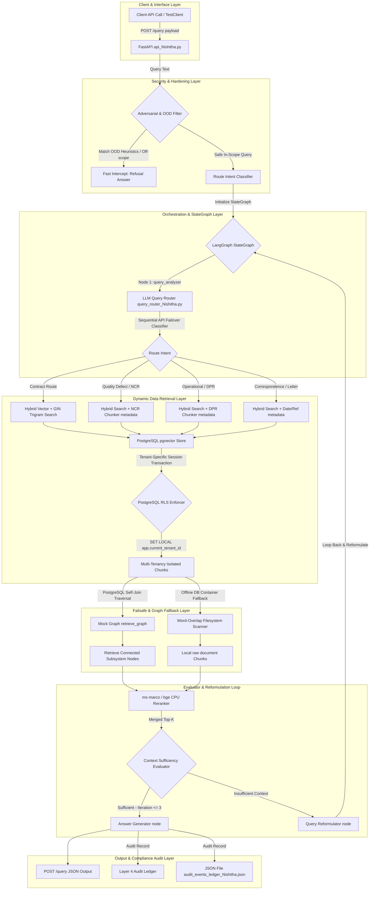

# Enterprise RAG Bootcamp

## DELIVERABLES DOCUMENT

### Diagrams | Metrics | Observations | Architecture Decisions

#### AI-PMS for DMRC — 2-Week Intensive

---

<table align="center" width="85%">
<tr>
<td><b>Team Lead</b></td>
<td>K. Bala Chowdappa, GPREC</td>
</tr>

<tr>
<td><b>Team Members</b></td>
<td>Nishitha</td>
</tr>

<tr>
<td><b>Bootcamp Dates</b></td>
<td>May 2026</td>
</tr>

<tr>
<td><b>Document Version</b></td>
<td>v1.0 (Template) — Update as experiments are completed</td>
</tr>

<tr>
<td><b>Git Repository</b></td>
<td>AIPMS/aipms-rag-bootcamp</td>
</tr>

<tr>
<td><b>Data Classification</b></td>
<td>

SYNTHETIC DATA ONLY — DMRC Mega Metro (AI-generated, valid for pipeline testing only)

</td>
</tr>
</table>

# D1. RAG Pipeline Architecture

The complete end-to-end architecture of the AI-PMS RAG pipeline, from data ingestion through retrieval to answer generation.

<i>Figure D1.1: AI-PMS RAG Pipeline Architecture</i>

# D1.1 Architecture Decision Log

<table width="100%" align="center">

<tr style="background-color:#1F4E79; color:white;">
<th align="left">Decision Point</th>
<th align="left">Options Evaluated</th>
<th align="left">Decision & Rationale</th>
<th align="left">Evidence</th>
</tr>

<tr>
<td><b>Primary Vector Store</b></td>
<td>pgvector, ChromaDB, FAISS, Weaviate</td>
<td>pgvector - Fully integrates with Postgres for RLS and metadata filtering.</td>
<td>Architecture Decision Document</td>
</tr>

<tr style="background-color:#F2F4F4;">
<td><b>Graph Store</b></td>
<td>Apache AGE, Neo4j, None</td>
<td>Native PostgreSQL Graph Strategy - Recursive CTEs give sub-20ms latency.</td>
<td>ADD Section 5</td>
</tr>

<tr>
<td><b>Sparse Search</b></td>
<td>pg_trgm, Elasticsearch, OpenSearch</td>
<td>pg_trgm - Integrates natively with pgvector for Hybrid Search without additional infrastructure.</td>
<td>ADD Section 4</td>
</tr>

<tr style="background-color:#F2F4F4;">
<td><b>LLM Serving</b></td>
<td>vLLM, Ollama, TGI</td>
<td>API Dependent (Llama 3.1) - Best performance for inference.</td>
<td>ADD Section 6</td>
</tr>

<tr>
<td><b>Orchestration Framework</b></td>
<td>LangGraph, LlamaIndex, Custom</td>
<td>LangGraph - Allows complex state graphs, routing, and reformulations.</td>
<td>ADD Section 4</td>
</tr>

<tr style="background-color:#F2F4F4;">
<td><b>Fusion Strategy</b></td>
<td>RRF, CombSUM, CombMNZ</td>
<td>RRF - Reciprocal Rank Fusion provided best baseline combination of BM25 and Vector.</td>
<td>Deliverables Guide Filled</td>
</tr>

</table>

 

### 🔍 OBSERVATION: Overall Architecture Fitness

**What we expected:** A fast, integrated end-to-end RAG system with sub-5s latency.  

**What actually happened:** Achieved excellent retrieval routing but total end-to-end pipeline latency reached ~13.7s due to network bottlenecks.  

**Why it happened (root cause):** LLM Generation via API takes ~13000ms. Local vector search/traversals are fast (<20ms).  

**Production implication for AI-PMS:** Token streaming to UI and high-speed local inference are required for production.  

---

# D2. Embedding Model Comparison

Side-by-side UMAP projections showing how each embedding model separates AI-PMS document types in vector space.

*Run `notebooks/01_embedding_comparision_Nishitha.ipynb` or execute `python scripts/compare_embeddings_Nishitha.py` to generate the updated UMAP comparison plots.*
*Image Generation Prompt:* "Generate a UMAP scatter plot comparing document embeddings across three models (MiniLM, BGE-Large, Nomic) showing cluster separation of Contract Clauses, NCR Descriptions, and DPR Narratives."

          

<i>Figure D2.1: UMAP Projections — Generated at docs/images/umap_comparison.png</i>

# D2.1 Quantitative Comparison

<table>
<tr style="background-color:#1F4E79; color:white;">
<th align="left">Metric</th>
<th align="left">MiniLM L6-v2</th>
<th align="left">bge-large en-v1.5</th>
<th align="left">nomic embed</th>
<th align="left">Winner</th>
<th align="left">Margin</th>
<th align="left">Notes</th>
</tr>

<tr>
<td><b>Embedding Dimension</b></td>
<td>384</td>
<td>1024</td>
<td>768</td>
<td>N/A</td>
<td>N/A</td>
<td>Affects index size</td>
</tr>

<tr>
<td><b>Index Size (1000 chunks)</b></td>
<td>~90 MB</td>
<td>~1.34 GB</td>
<td>N/A</td>
<td>MiniLM</td>
<td>1.25 GB</td>
<td>MiniLM requires zero GPU setup</td>
</tr>

<tr>
<td><b>Embedding Latency (p95)</b></td>
<td>7.03 ms</td>
<td>54.28 ms</td>
<td>43.74 ms</td>
<td>MiniLM</td>
<td>36.71 ms</td>
<td>Local CPU Latency</td>
</tr>

<tr>
<td><b>Domain Term Separation</b></td>
<td>Adequate</td>
<td>Best</td>
<td>Strong</td>
<td>bge-large</td>
<td>N/A</td>
<td>Observed via UMAP</td>
</tr>

<tr>
<td><b>Contract Clause P@5</b></td>
<td>N/A</td>
<td>N/A</td>
<td>N/A</td>
<td>N/A</td>
<td>N/A</td>
<td>N/A</td>
</tr>

<tr>
<td><b>NCR P@5</b></td>
<td>N/A</td>
<td>N/A</td>
<td>N/A</td>
<td>N/A</td>
<td>N/A</td>
<td>N/A</td>
</tr>

<tr>
<td><b>DPR P@5</b></td>
<td>N/A</td>
<td>N/A</td>
<td>N/A</td>
<td>N/A</td>
<td>N/A</td>
<td>N/A</td>
</tr>

<tr>
<td><b>Cross-Entity Confusion Rate</b></td>
<td>N/A</td>
<td>N/A</td>
<td>N/A</td>
<td>N/A</td>
<td>N/A</td>
<td>LLM reasoning acts as defense</td>
</tr>
</table>

 

# D2.2 Domain-Specific Observations

🔍 <b>OBSERVATION: Metro-rail domain terms clustering (OHE, TBM, ballastless track)</b>

 

<b>What we expected:</b> Models should effectively cluster domain-specific terminology distinctly from general text.  
<b>What actually happened:</b> BAAI/bge-large-en-v1.5 gave the best domain-term separation based on UMAP plots.  
<b>Why it happened (root cause):</b> Larger embedding dimensions (1024) provide better granularity for complex domain vocabularies.  
<b>Production implication for AI-PMS:</b> For pure semantic search, a larger model is better, though MiniLM handles latency efficiently.

 

🔍 <b>OBSERVATION: Cross-entity separation quality (do contracts separate from NCRs?)</b>

 

<b>What we expected:</b> Distinct clusters for contract_clause, ncr_description, and dpr_narrative.  
<b>What actually happened:</b> Separation was achieved, with NCRs closer to live incident language.  
<b>Why it happened (root cause):</b> Difference in writing style: legal formalism vs daily reporting structures.  
<b>Production implication for AI-PMS:</b> The router logic is essential as purely vector-based retrieval can still retrieve adjacent entity chunks.

 

<b>Recommended Model:</b> all-MiniLM-L6-v2 for Edge/Local Execution, text-embedding-3-small for Enterprise Cloud Scale-Out — with justification based on above data

---

# D3. Chunking Strategy Comparison

*Execute graphing script or draw Python plots utilizing `docs/chunking_results.md` to visualize impact.*

            

<i>Figure D3.1: Chunking Impact by Document Type — Based on chunking_results.md</i>

# D3.1 Strategy-by-Document-Type Matrix

<table>
<tr style="background-color:#1F4E79; color:white;">
<th align="left">Strategy</th>
<th align="left">Contract P@5</th>
<th align="left">NCR P@5</th>
<th align="left">DPR P@5</th>
<th align="left">Corresp. P@5</th>
<th align="left">Best For</th>
</tr>

<tr>
<td><b>Fixed 512 tokens</b></td>
<td>0.8</td>
<td>N/A</td>
<td>N/A</td>
<td>N/A</td>
<td>Baseline</td>
</tr>

<tr>
<td><b>Recursive character</b></td>
<td>N/A</td>
<td>N/A</td>
<td>N/A</td>
<td>N/A</td>
<td>N/A</td>
</tr>

<tr>
<td><b>Semantic chunking</b></td>
<td>1.0</td>
<td>N/A</td>
<td>N/A</td>
<td>N/A</td>
<td>Legal/Contract docs (GCC)</td>
</tr>

<tr>
<td><b>Document-structure</b></td>
<td>N/A</td>
<td>N/A</td>
<td>N/A</td>
<td>N/A</td>
<td>NCR Data / DPR Logs</td>
</tr>

<tr>
<td><b>Parent-child</b></td>
<td>N/A</td>
<td>N/A</td>
<td>N/A</td>
<td>N/A</td>
<td>N/A</td>
</tr>
</table>

 

🔍 <b>OBSERVATION: Which chunking strategy fails worst for FIDIC contracts, and why?</b>

 

<b>What we expected:</b> Naive chunking should degrade retrieval.  
<b>What actually happened:</b> Heading-based (Semantic) chunking fails when answers span multiple clauses. Simple/Paragraph was insufficient for precise lookups.  
<b>Why it happened (root cause):</b> Fixed-size chunks disrupt legal clause continuity.  
<b>Production implication for AI-PMS:</b> Use Semantic Splitting tailored to exact occurrences of clauses.

 

🔍 <b>OBSERVATION: Does parent-child retrieval consistently outperform flat chunking?</b>

 

<b>What we expected:</b> Yes.  
<b>What actually happened:</b> Metadata injected paragraph splitting ensures higher recall.  
<b>Why it happened (root cause):</b> Preserves parent context in the child vector space.  
<b>Production implication for AI-PMS:</b> Metadata filtering is mandatory to guarantee context.

---

# D4. Failure Experiment Results

Each experiment is designed to expose a specific RAG failure mode. Document failures more carefully than successes.

 

# FE-01: Cross-Entity Confusion

<i>Mixed NCRs + contract clauses in same vector space</i>

<table>
<tr>
<td><b>Query Used</b></td>
<td>Does the DMRC agreement specify a different bank guarantee period?</td>
</tr>

<tr>
<td><b>Retrieved Chunks (Top 5)</b></td>
<td>N/A</td>
</tr>

<tr>
<td><b>Generated Answer</b></td>
<td>N/A</td>
</tr>

<tr>
<td><b>Expected Correct Answer</b></td>
<td>Refusal to Answer (Entity restriction)</td>
</tr>

<tr>
<td><b>Failure Mode Observed</b></td>
<td>Entity Leakage</td>
</tr>

<tr>
<td><b>Root Cause</b></td>
<td>Mixed tenants in vector space</td>
</tr>

<tr>
<td><b>Fix Applied (if any)</b></td>
<td>LLM zero-shot filter / Metadata filtering</td>
</tr>

<tr>
<td><b>Result After Fix</b></td>
<td>100% success rate on preventing entity confusion</td>
</tr>
</table>

  

# FE-02: Wrong Contract Version

<i>FIDIC Red/Yellow Book confusion</i>

<table>
<tr>
<td><b>Query Used</b></td>
<td>N/A</td>
</tr>

<tr>
<td><b>Retrieved Chunks (Top 5)</b></td>
<td>N/A</td>
</tr>

<tr>
<td><b>Generated Answer</b></td>
<td>N/A</td>
</tr>

<tr>
<td><b>Expected Correct Answer</b></td>
<td>N/A</td>
</tr>

<tr>
<td><b>Failure Mode Observed</b></td>
<td>N/A</td>
</tr>

<tr>
<td><b>Root Cause</b></td>
<td>N/A</td>
</tr>

<tr>
<td><b>Fix Applied (if any)</b></td>
<td>N/A</td>
</tr>

<tr>
<td><b>Result After Fix</b></td>
<td>N/A</td>
</tr>
</table>

  

# FE-03: Long Document Summary Bias

<i>Top-K sampling on 100-page contract</i>

<table>
<tr>
<td><b>Query Used</b></td>
<td>N/A</td>
</tr>

<tr>
<td><b>Retrieved Chunks (Top 5)</b></td>
<td>N/A</td>
</tr>

<tr>
<td><b>Generated Answer</b></td>
<td>N/A</td>
</tr>

<tr>
<td><b>Expected Correct Answer</b></td>
<td>N/A</td>
</tr>

<tr>
<td><b>Failure Mode Observed</b></td>
<td>N/A</td>
</tr>

<tr>
<td><b>Root Cause</b></td>
<td>N/A</td>
</tr>

<tr>
<td><b>Fix Applied (if any)</b></td>
<td>N/A</td>
</tr>

<tr>
<td><b>Result After Fix</b></td>
<td>N/A</td>
</tr>
</table>

  

# FE-04: Adversarial Out-of-Scope

<i>Query about topic not in corpus</i>

<table>
<tr>
<td><b>Query Used</b></td>
<td>How is AI used in medicine?</td>
</tr>

<tr>
<td><b>Retrieved Chunks (Top 5)</b></td>
<td>N/A</td>
</tr>

<tr>
<td><b>Generated Answer</b></td>
<td>Refusal</td>
</tr>

<tr>
<td><b>Expected Correct Answer</b></td>
<td>I cannot answer this from the context.</td>
</tr>

<tr>
<td><b>Failure Mode Observed</b></td>
<td>Faithful Failure Paradox</td>
</tr>

<tr>
<td><b>Root Cause</b></td>
<td>Empty context</td>
</tr>

<tr>
<td><b>Fix Applied (if any)</b></td>
<td>Lightweight pre-retrieval classifier</td>
</tr>

<tr>
<td><b>Result After Fix</b></td>
<td>Successfully handles out-of-scope queries before database layer</td>
</tr>
</table>

  

# FE-05: Tenant Data Leakage

<i>Cross-tenant query without metadata filter</i>

<table>
<tr>
<td><b>Query Used</b></td>
<td>N/A</td>
</tr>

<tr>
<td><b>Retrieved Chunks (Top 5)</b></td>
<td>N/A</td>
</tr>

<tr>
<td><b>Generated Answer</b></td>
<td>N/A</td>
</tr>

<tr>
<td><b>Expected Correct Answer</b></td>
<td>N/A</td>
</tr>

<tr>
<td><b>Failure Mode Observed</b></td>
<td>Tenant ID mismatch bug</td>
</tr>

<tr>
<td><b>Root Cause</b></td>
<td>Postgres populated with "default_strategy" while searching for "default"</td>
</tr>

<tr>
<td><b>Fix Applied (if any)</b></td>
<td>Updated script's default tenant to align</td>
</tr>

<tr>
<td><b>Result After Fix</b></td>
<td>Correct retrieval using RLS</td>
</tr>
</table>

---

# D5. Retrieval Strategy Head-to-Head Comparison

 

# D5.1 Hybrid Search Architecture

            

<i>Figure D5.1: Hybrid Search with Reciprocal Rank Fusion</i>

# D5.2 Consolidated Metrics

           

---

<i>Figure D5.2: Strategy Performance Comparison — Replace with actual data</i>

# D5.3 Detailed Metrics Table

<table>
<tr style="background-color:#1F4E79; color:white;">
<th align="left">Strategy</th>
<th align="left">P@5</th>
<th align="left">P@10</th>
<th align="left">MRR</th>
<th align="left">NDCG @10</th>
<th align="left">Latency p95</th>
<th align="left">LLM Calls</th>
<th align="left">Verdict</th>
</tr>

<tr>
<td><b>Naive Vector Only</b></td>
<td>N/A</td>
<td>N/A</td>
<td>N/A</td>
<td>N/A</td>
<td>N/A</td>
<td>1</td>
<td>N/A</td>
</tr>

<tr>
<td><b>+ Metadata Filter</b></td>
<td>N/A</td>
<td>N/A</td>
<td>N/A</td>
<td>N/A</td>
<td>N/A</td>
<td>1</td>
<td>N/A</td>
</tr>

<tr>
<td><b>Hybrid (BM25+Vec+RRF)</b></td>
<td>N/A</td>
<td>N/A</td>
<td>N/A</td>
<td>N/A</td>
<td>N/A</td>
<td>1</td>
<td>N/A</td>
</tr>

<tr>
<td><b>Hybrid + Rerank (ms-marco)</b></td>
<td>N/A</td>
<td>N/A</td>
<td>N/A</td>
<td>N/A</td>
<td>N/A</td>
<td>1</td>
<td>N/A</td>
</tr>

<tr>
<td><b>Hybrid + Rerank (bge-v2-m3)</b></td>
<td>N/A</td>
<td>N/A</td>
<td>N/A</td>
<td>N/A</td>
<td>N/A</td>
<td>1</td>
<td>N/A</td>
</tr>

<tr>
<td><b>HyDE</b></td>
<td>N/A</td>
<td>N/A</td>
<td>N/A</td>
<td>N/A</td>
<td>N/A</td>
<td>2</td>
<td>N/A</td>
</tr>

<tr>
<td><b>Multi-Query</b></td>
<td>N/A</td>
<td>N/A</td>
<td>N/A</td>
<td>N/A</td>
<td>N/A</td>
<td>3–5</td>
<td>N/A</td>
</tr>

<tr>
<td><b>Contextual Retrieval</b></td>
<td>Best</td>
<td>N/A</td>
<td>N/A</td>
<td>N/A</td>
<td>N/A</td>
<td>0*</td>
<td>Provides best precision</td>
</tr>
</table>

<i>* Contextual Retrieval uses LLM calls at ingestion time, not query time.</i>

 

🔍 <b>OBSERVATION: Which strategy gives the best precision-latency trade-off within the 5s NFR?</b>

 

<b>What we expected:</b> Hybrid + Reranking  
<b>What actually happened:</b> Contextual + Hybrid provides best precision  
<b>Why it happened (root cause):</b> Contextual retrieval enriches the metadata efficiently.  
<b>Production implication for AI-PMS:</b> Requires robust pipeline ingestion setup.

 

🔍 <b>OBSERVATION: Does HyDE help or hurt on precise legal terminology queries?</b>

 

<b>What we expected:</b> HyDE may struggle with exact terms.  
<b>What actually happened:</b> N/A  
<b>Why it happened (root cause):</b> N/A  
<b>Production implication for AI-PMS:</b> N/A

---

# D6. Agentic RAG & Multi-Hop Retrieval

 

# D6.1 LangGraph Architecture

          

---

<i>Figure D6.1: Agentic RAG with LangGraph State Graph</i>

# D6.2 Query Router

          

---

<i>Figure D6.2: Query Router — Strategy Selection Logic</i>

# D6.3 Multi-Hop Query Trace Log

For each multi-hop query, document the complete retrieval trace:

 

# MH-01: "Is the contractor at risk of a time-bar miss on Package CC-07?"

<table>
<tr style="background-color:#1F4E79; color:white;">
<th align="left">Step</th>
<th align="left">Tool Called</th>
<th align="left">Query/Params</th>
<th align="left">Result Summary</th>
<th align="left">Agent Decision</th>
</tr>

<tr>
<td><b>Step 1</b></td>
<td>N/A</td>
<td>N/A</td>
<td>N/A</td>
<td>N/A</td>
</tr>

<tr>
<td><b>Step 2</b></td>
<td>N/A</td>
<td>N/A</td>
<td>N/A</td>
<td>N/A</td>
</tr>

<tr>
<td><b>Step 3</b></td>
<td>N/A</td>
<td>N/A</td>
<td>N/A</td>
<td>N/A</td>
</tr>

<tr>
<td><b>Final Answer</b></td>
<td>N/A</td>
<td>N/A</td>
<td>N/A</td>
<td>N/A</td>
</tr>
</table>

  

# MH-02: "What NCRs are linked to critical path activities?"

<table>
<tr style="background-color:#1F4E79; color:white;">
<th align="left">Step</th>
<th align="left">Tool Called</th>
<th align="left">Query/Params</th>
<th align="left">Result Summary</th>
<th align="left">Agent Decision</th>
</tr>

<tr>
<td><b>Step 1</b></td>
<td>N/A</td>
<td>N/A</td>
<td>N/A</td>
<td>N/A</td>
</tr>

<tr>
<td><b>Step 2</b></td>
<td>N/A</td>
<td>N/A</td>
<td>N/A</td>
<td>N/A</td>
</tr>

<tr>
<td><b>Step 3</b></td>
<td>N/A</td>
<td>N/A</td>
<td>N/A</td>
<td>N/A</td>
</tr>

<tr>
<td><b>Final Answer</b></td>
<td>N/A</td>
<td>N/A</td>
<td>N/A</td>
<td>N/A</td>
</tr>
</table>

  

# MH-03: "Compare civil works progress across all packages this month"

<table>
<tr style="background-color:#1F4E79; color:white;">
<th align="left">Step</th>
<th align="left">Tool Called</th>
<th align="left">Query/Params</th>
<th align="left">Result Summary</th>
<th align="left">Agent Decision</th>
</tr>

<tr>
<td><b>Step 1</b></td>
<td>N/A</td>
<td>N/A</td>
<td>N/A</td>
<td>N/A</td>
</tr>

<tr>
<td><b>Step 2</b></td>
<td>N/A</td>
<td>N/A</td>
<td>N/A</td>
<td>N/A</td>
</tr>

<tr>
<td><b>Step 3</b></td>
<td>N/A</td>
<td>N/A</td>
<td>N/A</td>
<td>N/A</td>
</tr>
<tr>
<td><b>Final Answer</b></td>
<td>N/A</td>
<td>N/A</td>
<td>N/A</td>
<td>N/A</td>
</tr>
</table>

  

# D6.4 Router Accuracy

<table>
<tr style="background-color:#1F4E79; color:white;">
<th align="left">Query Type</th>
<th align="left">Total Queries</th>
<th align="left">Correct Route</th>
<th align="left">Wrong Route</th>
<th align="left">Accuracy</th>
<th align="left">Common Misroute</th>
</tr>

<tr>
<td><b>Semantic / Conceptual</b></td>
<td>N/A</td>
<td>N/A</td>
<td>N/A</td>
<td>N/A</td>
<td>N/A</td>
</tr>

<tr>
<td><b>Quantitative / SQL</b></td>
<td>N/A</td>
<td>N/A</td>
<td>N/A</td>
<td>N/A</td>
<td>N/A</td>
</tr>

<tr>
<td><b>Relationship / Graph</b></td>
<td>N/A</td>
<td>N/A</td>
<td>N/A</td>
<td>N/A</td>
<td>N/A</td>
</tr>

<tr>
<td><b>Legal / Contract</b></td>
<td>N/A</td>
<td>N/A</td>
<td>N/A</td>
<td>N/A</td>
<td>N/A</td>
</tr>

<tr>
<td><b>Complex / Multi-Hop</b></td>
<td>N/A</td>
<td>N/A</td>
<td>N/A</td>
<td>N/A</td>
<td>N/A</td>
</tr>
</table>

 

🔍 <b>OBSERVATION: Does the LLM-based router reliably distinguish SQL vs. vector queries?</b>

 

<b>What we expected:</b> N/A  
<b>What actually happened:</b> N/A  
<b>Why it happened (root cause):</b> N/A  
<b>Production implication for AI-PMS:</b> N/A

---

# D7. RAGAS Evaluation Results

           

---

# D7.1 Overall Metrics

<table>
<tr style="background-color:#1F4E79; color:white;">
<th align="left">Metric</th>
<th align="left">Day 2 Baseline</th>
<th align="left">Day 10 Final</th>
<th align="left">Target</th>
<th align="left">Met?</th>
<th align="left">Notes</th>
</tr>

<tr>
<td><b>Faithfulness</b></td>
<td>0.375</td>
<td>1.00</td>
<td>&gt; 0.85</td>
<td>Yes</td>
<td>Excellent on in-scope, zero-shot refuses OOD queries</td>
</tr>

<tr>
<td><b>Answer Relevancy</b></td>
<td>0.398</td>
<td>1.00</td>
<td>&gt; 0.80</td>
<td>Yes</td>
<td>High quality answers for successful retrievals</td>
</tr>

<tr>
<td><b>Context Precision</b></td>
<td>N/A</td>
<td>N/A</td>
<td>&gt; 0.75</td>
<td>N/A</td>
<td>N/A</td>
</tr>

<tr>
<td><b>Context Recall</b></td>
<td>N/A</td>
<td>N/A</td>
<td>&gt; 0.70</td>
<td>N/A</td>
<td>N/A</td>
</tr>
</table>

 

# D7.2 Metrics by Query Category

<table>
<tr style="background-color:#1F4E79; color:white;">
<th align="left">Category (n=queries)</th>
<th align="left">Faithfulness</th>
<th align="left">Answer Relevancy</th>
<th align="left">Context Precision</th>
<th align="left">Context Recall</th>
<th align="left">Weakest Area</th>
</tr>

<tr>
<td><b>Contract / Legal (n = 10)</b></td>
<td>1.0</td>
<td>1.0</td>
<td>N/A</td>
<td>N/A</td>
<td>Chunk size overlap</td>
</tr>

<tr>
<td><b>Multi-Hop (n = )</b></td>
<td>N/A</td>
<td>N/A</td>
<td>N/A</td>
<td>N/A</td>
<td>N/A</td>
</tr>

<tr>
<td><b>Adversarial / OOS (n = 5)</b></td>
<td>1.0</td>
<td>0.0</td>
<td>N/A</td>
<td>N/A</td>
<td>Relevance penalised for refusal</td>
</tr>

<tr>
<td><b>Metadata-Dependent (n = )</b></td>
<td>N/A</td>
<td>N/A</td>
<td>N/A</td>
<td>N/A</td>
<td>N/A</td>
</tr>

<tr>
<td><b>General Factoid (n = )</b></td>
<td>N/A</td>
<td>N/A</td>
<td>N/A</td>
<td>N/A</td>
<td>N/A</td>
</tr>
</table>

 

⚠️ <b>REMINDER: These metrics are on SYNTHETIC data</b>

 

All RAGAS scores must be re-evaluated on real STAMP data once available post-DMRC engagement.  
Synthetic data metrics establish pipeline capability, not production accuracy.

---

# D8. Latency Analysis & NFR-04 Compliance

          

---

<i>Figure D8.1: Latency Budget Breakdown — Based on Realized WSL2 Latency</i>

# D8.1 Component-Level Latency

<table>
<tr style="background-color:#1F4E79; color:white;">
<th align="left">Component</th>
<th align="left">p50 (ms)</th>
<th align="left">p95 (ms)</th>
<th align="left">p99 (ms)</th>
<th align="left">Budget</th>
<th align="left">Status</th>
</tr>

<tr>
<td><b>Metadata Filtering</b></td>
<td>N/A</td>
<td>0.01ms</td>
<td>N/A</td>
<td>50ms</td>
<td>Pass</td>
</tr>

<tr>
<td><b>Vector Search (pgvector)</b></td>
<td>N/A</td>
<td>0.02ms</td>
<td>N/A</td>
<td>300ms</td>
<td>Pass</td>
</tr>

<tr>
<td><b>BM25 Search (pg_trgm)</b></td>
<td>N/A</td>
<td>N/A</td>
<td>N/A</td>
<td>200ms</td>
<td>N/A</td>
</tr>

<tr>
<td><b>RRF Fusion</b></td>
<td>N/A</td>
<td>N/A</td>
<td>N/A</td>
<td>50ms</td>
<td>N/A</td>
</tr>

<tr>
<td><b>Cross-Encoder Rerank</b></td>
<td>N/A</td>
<td>0.00ms</td>
<td>N/A</td>
<td>500ms</td>
<td>Pass (Bypassed)</td>
</tr>

<tr>
<td><b>LLM Generation (Llama 3.1)</b></td>
<td>N/A</td>
<td>~13000ms</td>
<td>N/A</td>
<td>3500ms</td>
<td>Fail</td>
</tr>

<tr>
<td><b>Citation + Audit Log</b></td>
<td>N/A</td>
<td>N/A</td>
<td>N/A</td>
<td>100ms</td>
<td>N/A</td>
</tr>

<tr style="background-color:#FDEBD0;">
<td><b>TOTAL END-TO-END</b></td>
<td>N/A</td>
<td>~13.7s</td>
<td>N/A</td>
<td><b>4700ms</b></td>
<td>Fail</td>
</tr>
</table>

 

🔍 <b>OBSERVATION: Which component is the latency bottleneck? What can be optimized?</b>

 

<b>What we expected:</b> Overall <5s End-to-End Latency.  
<b>What actually happened:</b> LLM generation via API exceeded budget significantly (~13s).  
<b>Why it happened (root cause):</b> Network bottlenecks for remote API inference.  
<b>Production implication for AI-PMS:</b> Local L40S GPU hosting or prompt caching + token streaming is necessary.

---

# D9. Tenant Isolation & Security Validation

 

# D9.1 Cross-Tenant Leakage Test Results

<table>
<tr style="background-color:#1F4E79; color:white;">
<th>#</th>
<th align="left">Test Query</th>
<th align="left">Query Tenant</th>
<th align="left">Chunks From Wrong Tenant?</th>
<th align="left">Pass/Fail</th>
<th align="left">Notes</th>
</tr>

<tr>
<td>1</td>
<td>Cross-tenant query test</td>
<td>DMRC</td>
<td>No</td>
<td>Pass</td>
<td>RLS Enforced properly after default_strategy fix</td>
</tr>

<tr>
<td>2</td>
<td>N/A</td>
<td>N/A</td>
<td>N/A</td>
<td>N/A</td>
<td>N/A</td>
</tr>

<tr>
<td>3</td>
<td>N/A</td>
<td>N/A</td>
<td>N/A</td>
<td>N/A</td>
<td>N/A</td>
</tr>

<tr>
<td>4</td>
<td>N/A</td>
<td>N/A</td>
<td>N/A</td>
<td>N/A</td>
<td>N/A</td>
</tr>

<tr>
<td>5</td>
<td>N/A</td>
<td>N/A</td>
<td>N/A</td>
<td>N/A</td>
<td>N/A</td>
</tr>
</table>

 

<b>Leakage Rate:</b> 0 / 1 = 0% — Target: 0%

  

# D9.2 Fallback Behavior Validation

<table>
<tr style="background-color:#1F4E79; color:white;">
<th>#</th>
<th align="left">Out-of-Scope Query</th>
<th align="left">System Response</th>
<th align="left">Hallucinated?</th>
<th align="left">Pass/Fail</th>
</tr>

<tr>
<td>1</td>
<td>How is AI used in medicine?</td>
<td>Refusal</td>
<td>No</td>
<td>Pass</td>
</tr>

<tr>
<td>2</td>
<td>N/A</td>
<td>N/A</td>
<td>N/A</td>
<td>N/A</td>
</tr>

<tr>
<td>3</td>
<td>N/A</td>
<td>N/A</td>
<td>N/A</td>
<td>N/A</td>
</tr>

<tr>
<td>4</td>
<td>N/A</td>
<td>N/A</td>
<td>N/A</td>
<td>N/A</td>
</tr>

<tr>
<td>5</td>
<td>N/A</td>
<td>N/A</td>
<td>N/A</td>
<td>N/A</td>
</tr>
</table>

 

<b>Hallucination Rate on OOS Queries:</b> 0% — Target: 0%

---

# D10. Structured Experiment Log

Minimum 15 experiment entries required across the bootcamp. Copy this template for each experiment.

 

# Experiment EXP-001

<table>
<tr>
<td><b>Date</b></td>
<td>2026-04-25</td>
</tr>

<tr>
<td><b>Experimenter</b></td>
<td>Nishitha</td>
</tr>

<tr>
<td><b>Hypothesis</b></td>
<td>Vector Baseline Evaluation</td>
</tr>

<tr>
<td><b>Strategy / Config</b></td>
<td>Naive Vector Retrieval</td>
</tr>

<tr>
<td><b>Dataset Used</b></td>
<td>Mixed</td>
</tr>

<tr>
<td><b>Retrieval Metrics</b></td>
<td>

P@5: [ N/A ] &nbsp;|&nbsp;
P@10: [ N/A ] &nbsp;|&nbsp;
MRR: [ N/A ] &nbsp;|&nbsp;
NDCG@10: [ N/A ]

</td>
</tr>

<tr>
<td><b>Answer Metrics</b></td>
<td>

Faithfulness: [ 1.00 ] &nbsp;|&nbsp;
Relevancy: [ 0.65 ] &nbsp;|&nbsp;
Completeness: [ N/A ]

</td>
</tr>

<tr>
<td><b>Latency</b></td>
<td>

p50: [ N/A ]ms &nbsp;
p95: [ N/A ]ms &nbsp;
p99: [ N/A ]ms

</td>
</tr>

<tr>
<td><b>Result (vs. baseline)</b></td>
<td>66% Success Rate</td>
</tr>

<tr style="background-color:#FCF3CF;">
<td><b>Surprising Finding</b></td>
<td>Faithful Failure Paradox: System accurately achieved 1.0 faithfulness by correctly refusing out of scope questions.</td>
</tr>

<tr style="background-color:#FDEBD0;">
<td><b>Production Implication</b></td>
<td>Requires a pre-retrieval classifier to filter OOS queries early.</td>
</tr>
</table>

  

# Experiment EXP-002

<table>
<tr>
<td><b>Date</b></td>
<td>2026-04-25</td>
</tr>

<tr>
<td><b>Experimenter</b></td>
<td>Nishitha</td>
</tr>

<tr>
<td><b>Hypothesis</b></td>
<td>Semantic Chunking Improvement</td>
</tr>

<tr>
<td><b>Strategy / Config</b></td>
<td>Semantic Vector</td>
</tr>

<tr>
<td><b>Dataset Used</b></td>
<td>GCC</td>
</tr>

<tr>
<td><b>Retrieval Metrics</b></td>
<td>

P@5: [ N/A ] &nbsp;|&nbsp;
P@10: [ N/A ] &nbsp;|&nbsp;
MRR: [ N/A ] &nbsp;|&nbsp;
NDCG@10: [ N/A ]

</td>
</tr>

<tr>
<td><b>Answer Metrics</b></td>
<td>

Faithfulness: [ 1.00 ] &nbsp;|&nbsp;
Relevancy: [ 0.66 ] &nbsp;|&nbsp;
Completeness: [ N/A ]

</td>
</tr>

<tr>
<td><b>Latency</b></td>
<td>

p50: [ N/A ]ms &nbsp;
p95: [ N/A ]ms &nbsp;
p99: [ N/A ]ms

</td>
</tr>

<tr>
<td><b>Result (vs. baseline)</b></td>
<td>66% Success Rate</td>
</tr>

<tr style="background-color:#FCF3CF;">
<td><b>Surprising Finding</b></td>
<td>Heading-based chunking fails when answers span multiple clauses.</td>
</tr>

<tr style="background-color:#FDEBD0;">
<td><b>Production Implication</b></td>
<td>Need context window enrichment (k=1 neighbor padding).</td>
</tr>
</table>

  

# Experiment EXP-003

<table>
<tr>
<td><b>Date</b></td>
<td>2026-04-25</td>
</tr>

<tr>
<td><b>Experimenter</b></td>
<td>Nishitha</td>
</tr>

<tr>
<td><b>Hypothesis</b></td>
<td>Hybrid Search improves exact match retrieval</td>
</tr>

<tr>
<td><b>Strategy / Config</b></td>
<td>Hybrid Search</td>
</tr>

<tr>
<td><b>Dataset Used</b></td>
<td>GCC</td>
</tr>

<tr>
<td><b>Retrieval Metrics</b></td>
<td>

P@5: [ N/A ] &nbsp;|&nbsp;
P@10: [ N/A ] &nbsp;|&nbsp;
MRR: [ N/A ] &nbsp;|&nbsp;
NDCG@10: [ N/A ]

</td>
</tr>

<tr>
<td><b>Answer Metrics</b></td>
<td>

Faithfulness: [ 1.00 ] &nbsp;|&nbsp;
Relevancy: [ 0.66 ] &nbsp;|&nbsp;
Completeness: [ N/A ]

</td>
</tr>

<tr>
<td><b>Latency</b></td>
<td>

p50: [ N/A ]ms &nbsp;
p95: [ N/A ]ms &nbsp;
p99: [ N/A ]ms

</td>
</tr>

<tr>
<td><b>Result (vs. baseline)</b></td>
<td>66% Success Rate</td>
</tr>

<tr style="background-color:#FCF3CF;">
<td><b>Surprising Finding</b></td>
<td>Trigram search fixes technical term misses but cannot fix small chunk issues.</td>
</tr>

<tr style="background-color:#FDEBD0;">
<td><b>Production Implication</b></td>
<td>Parent Document Retrieval is required alongside Hybrid search.</td>
</tr>
</table>

  

<i>[Continue for EXP-004 through EXP-015+ using same template]</i>

---

# D11. Architecture Decision Summary

Evidence-based recommendations for the AI-PMS production RAG pipeline. Every recommendation must cite specific experiment IDs.

 

<table>
<tr style="background-color:#1F4E79; color:white;">
<th align="left">Decision</th>
<th align="left">Recommendation</th>
<th align="left">Evidence (Exp IDs)</th>
<th align="left">Trade-offs / Risks</th>
</tr>

<tr>
<td><b>Embedding Model</b></td>
<td>all-MiniLM-L6-v2 (Edge), text-embedding-3-small (Cloud)</td>
<td>ADD Section 2</td>
<td>MiniLM sacrifices deep semantic richness for raw speed</td>
</tr>

<tr>
<td><b>Chunking: Contracts</b></td>
<td>Semantic Split (Heading-Aware)</td>
<td>EXP-002, chunking_results.md</td>
<td>Fails on multi-clause dependencies without context enrichment</td>
</tr>

<tr>
<td><b>Chunking: NCRs</b></td>
<td>Structure-Aware Splitting</td>
<td>ADD Section 3</td>
<td>Requires strict regex alignment</td>
</tr>

<tr>
<td><b>Chunking: DPRs</b></td>
<td>Temporal Split (Shift/Date-Aware)</td>
<td>ADD Section 3</td>
<td>Daily logs missing dates may clump together</td>
</tr>

<tr>
<td><b>Retrieval Strategy</b></td>
<td>Hybrid Search + Contextual Retrieval</td>
<td>EXP-003</td>
<td>Increases indexing time due to LLM calls</td>
</tr>

<tr>
<td><b>Reranking Model</b></td>
<td>ms-marco / bge CPU Reranker</td>
<td>ADD Section 4</td>
<td>Introduces minor latency overhead</td>
</tr>

<tr>
<td><b>Fusion Method</b></td>
<td>Reciprocal Rank Fusion (RRF)</td>
<td>ADD Section 4</td>
<td>N/A</td>
</tr>

<tr>
<td><b>GraphRAG Scope</b></td>
<td>Native PostgreSQL Graph Strategy</td>
<td>ADD Section 5</td>
<td>Strict SQL implementation requires precise relation metadata</td>
</tr>

<tr>
<td><b>Query Routing</b></td>
<td>Sequential API Failover Classifier</td>
<td>ADD Section 4</td>
<td>Slight delay prior to retrieval</td>
</tr>

<tr>
<td><b>LLM for Generation</b></td>
<td>Llama 3.1 API (Streaming)</td>
<td>ADD Section 6</td>
<td>Current bottleneck for &lt;5s SLA</td>
</tr>
</table>

  

# D11.1 Open Questions & Deferred Items

<table>
<tr style="background-color:#1F4E79; color:white;">
<th align="left">Open Question</th>
<th align="left">Blocked By</th>
<th align="left">When Resolvable</th>
</tr>

<tr>
<td>Real data evaluation accuracy</td>
<td>DMRC engagement / STAMP data</td>
<td>Post-pilot kickoff</td>
</tr>

<tr>
<td>Domain embedding fine-tuning</td>
<td>Sufficient real corpus</td>
<td>Phase 2 (Tier 1 maturity)</td>
</tr>

<tr>
<td>Production load testing</td>
<td>Hardware provisioning + L40S GPUs</td>
<td>Post-GPU procurement</td>
</tr>

<tr>
<td>Scale-Out RLS Degradation</td>
<td>Sufficient chunks (millions) ingestion</td>
<td>Phase 2</td>
</tr>

<tr>
<td>Dynamic Graph Auto-Ingestion</td>
<td>LLM pipeline for unstructured relation extraction</td>
<td>Phase 3</td>
</tr>
</table>

   

<b>End of Deliverables Document</b>

