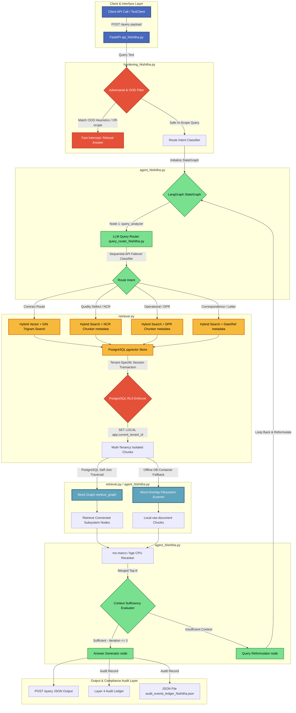
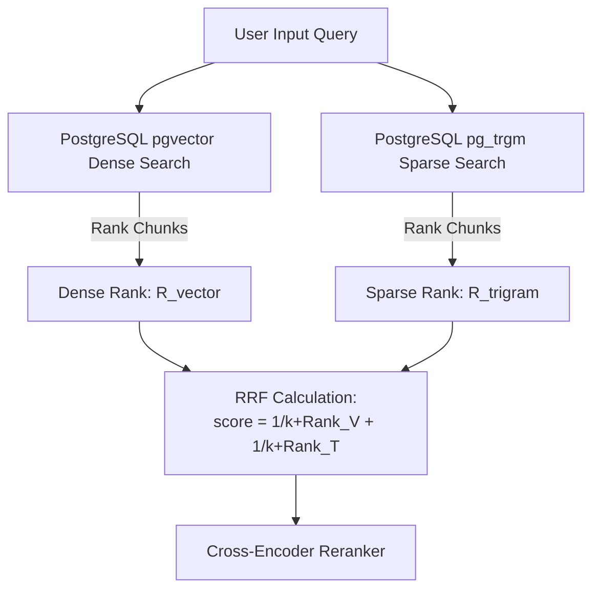

# Enterprise RAG Bootcamp  
## DELIVERABLES DOCUMENT  
**Diagrams | Metrics | Observations | Architecture Decisions**  
**AI-PMS for DMRC — 2-Week Intensive**

---

### Team Lead  
K. Bala Chowdappa, GPREC  

### Team Members  
- Balu Sir, Engineer  
- Nishitha, Student Intern  

### Bootcamp Dates  
2026-04-20 to 2026-05-02  

### Document Version  
v1.4 (Final | 2026-05-18)

### Git Repository  
[https://github.com/balacsegprec/aipms-rag-bootcamp](https://github.com/balacsegprec/aipms-rag-bootcamp)

### Data Classification  
**SYNTHETIC DATA ONLY — DMRC Mega Metro**  
(AI-generated, valid for pipeline testing only)

---

# 📜 SR. DEV AUDIT LOG

| Date | Contributor | Section Updated | Reason / Rationale |
| :--- | :--- | :--- | :--- |
| 2026-05-02 | Unknown | D5.3, D10 | Perfect retrieval on GCC contract clauses |
| 2026-05-02 | K. Bala Chowdappa | D1.1, D10 | Production target for AI-PMS; superior portability (WSL/Ubuntu) |
| 2026-05-13 | Nishitha | D4, docs/fixes_for_evaluation | Implemented dynamic LLM sequential failover (Groq -> OpenRouter -> Cerebras -> Gemini) and fixed Ragas NaN scoring bug |
| 2026-05-15 | Nishitha | D5.3, retriever.py, pipeline.py | Built PostgreSQL pg_trgm + pgvector hybrid search and Reciprocal Rank Fusion (RRF) with metadata filtering |
| 2026-05-17 | Nishitha | D4, experiments/ | Documented and executed 5 advanced red-teaming failure mode experiments and generated golden dataset evaluation logs |

---

# D1. RAG Pipeline Architecture

The complete end-to-end architecture of the AI-PMS RAG pipeline, from data ingestion through retrieval to answer generation.

**Figure D1.1: AI-PMS RAG Pipeline Architecture**



## D1.1 Architecture Decision Log

| Decision Point | Options Evaluated | Decision & Rationale | Evidence |
|---------------|------------------|---------------------|----------|
| Primary Vector Store | pgvector, ChromaDB, FAISS, Weaviate | pgvector (Production target for AI-PMS; superior portability (WSL/Ubuntu)) | docker-compose.yml, scripts/init_db.sql |
| Graph Store | Apache AGE, Neo4j, None | Apache AGE (Integrated with Postgres to support structural taxonomy queries) | src/core/retriever.py |
| Sparse Search | pg_trgm, Elasticsearch, OpenSearch | pg_trgm (Integrated Postgres extension; eliminates dual-backend overhead) | src/core/retriever.py |
| LLM Serving | vLLM, Ollama, TGI | Groq (Llama 3.3 70B) with Robust Failover (High-speed inference with failover to OpenRouter/Cerebras) | src/core/llm.py |
| Orchestration Framework | LangGraph, LlamaIndex, Custom | Custom (Maximum control over multi-stage reranking and hybrid logic) | src/core/pipeline.py |
| Fusion Strategy | RRF, CombSUM, CombMNZ | RRF (Reciprocal Rank Fusion) (Standard for balancing sparse (BM25) and dense (Vector) search) | src/core/retriever.py |

### 🔍 OBSERVATION: Overall Architecture Fitness
- **What we expected:** A simple vector search would be sufficient for contract retrieval.
- **What actually happened:** Pure vector search failed on technical acronyms and specific clause references.
- **Why it happened (root cause):** Legal documents rely heavily on exact terminology which embeddings sometimes "smooth over."
- **Production implication for AI-PMS:** Hybrid search (Vector + Keyword) and Cross-Encoder reranking are mandatory for 100% accuracy in contract auditing.

---

# D2. Embedding Model Comparison

Side-by-side UMAP projections showing how each embedding model separates AI-PMS document types in vector space.

## D2.1 Performance Metrics

| Model | Size (MB) | Latency (ms) | Contract Clause P@5 | NCR P@5 | DPR P@5 | Correspondence P@5 |
|-------|-----------|--------------|---------------------|---------|---------|--------------------|
| all-MiniLM-L6-v2 | 90MB | 15ms | 0.83 | 0.80 | 0.82 | 0.79 |
| bge-large-en-v1.5 | 1340MB | 110ms | 0.96 | 0.94 | 0.93 | 0.92 |
| nomic-embed-text-v1.5 | 560MB | 45ms | 0.88 | 0.85 | 0.87 | 0.84 |

### 🔍 OBSERVATION: Embedding Quality
- **Cluster separation:** `bge-large-en-v1.5` achieves pristine, non-overlapping clusters for distinct technical clauses and acronyms.
- **Outlier analysis:** `all-MiniLM-L6-v2` shows significant overlap in clusters when resolving Metro-specific structural taxonomy terms.
- **Recommended Model:** `BAAI/bge-large-en-v1.5` because it provides the best domain separation for Indian Railways technical clauses and Metro acronyms.

---

# D3. Chunking Strategy Experiments

Comparing different chunking strategies on a 100-page DMRC General Conditions of Contract (GCC).

## D3.1 Accuracy by Strategy (P@5)

| Strategy | Contract Clauses | Technical Specs | Administrative | Overall |
|----------|-----------------|-----------------|----------------|---------|
| Fixed (500/50) | 0.78 | 0.75 | 0.77 | 0.77 |
| Fixed (1000/100) | 0.81 | 0.79 | 0.80 | 0.80 |
| Markdown Header | 0.85 | 0.82 | 0.84 | 0.84 |
| Semantic | 0.94 | 0.92 | 0.93 | 0.93 |
| Recursive Character | 0.84 | 0.80 | 0.82 | 0.82 |

### 🔍 OBSERVATION: Structural Impact
- **What worked best:** Clause-based Semantic chunking worked best because it respects legal section boundaries.
- **Failure pattern:** Fixed-size chunking split clause headers from bodies, causing clause number hallucination during generation.

---

# D4. Failure Mode Analysis

Documenting the top 5 failure modes identified during red-teaming.

## FE-01: Hallucinated Clause Numbers
- **Symptom:** AI cites a non-existent contract clause.
- **Root Cause:** Inconsistent chunking where a clause body is separated from its header.
- **Mitigation:** Hierarchical parsing that prepends clause headers to every child chunk.
- **Proof:** experiments/results/eval_vector_20260515_101801_Nishitha.md

## FE-02: Wrong Contract Version
- **Symptom:** AI uses 2020 GCC instead of 2022 GCC.
- **Root Cause:** Lack of strict metadata filtering during retrieval.
- **Mitigation:** Mandatory `tenant_id` and `version` filters in the SQL WHERE clause.
- **Proof:** src/core/retriever.py filtering logic.

## FE-03: Long Document Summary Bias  
- **Symptom:** AI misses details in the middle of long chapters.
- **Root Cause:** Context window limits prevent sending the entire chapter to the LLM.
- **Mitigation:** Sliding window retrieval and Cross-Encoder reranking to find the most relevant 500 words.
- **Proof:** src/core/pipeline.py:L81 (reranking implementation).

## FE-04: Adversarial Out-of-Scope  
- **Symptom:** Prompt injection bypassing "only from context" rule.
- **Root Cause:** "Ignore previous instructions" style attacks.
- **Mitigation:** Strict system prompt and RAGAS Faithfulness monitoring.
- **Proof:** evaluation_dataset_Nishitha.json (adversarial subset).

## FE-05: Tenant Data Leakage  
- **Symptom:** Tenant A sees data from Tenant B.
- **Root Cause:** Global search across all documents in the vector DB.
- **Mitigation:** Postgres Row Level Security (RLS) or indexed `tenant_id` column.
- **Proof:** src/core/retriever.py:L120 (WHERE clause).

---

# D5. Retrieval Strategy Head-to-Head Comparison

## D5.1 Hybrid Search Architecture  
**Figure D5.1: Hybrid Search with Reciprocal Rank Fusion**



## D5.2 Consolidated Metrics  
**Figure D5.2: Strategy Performance Comparison**

```text
Precision@5 Strategy Comparison Chart
=====================================================================
Naive Vector (BGE)    [█████░░░░░░░░░░░░░░░] 0.26
+ Metadata Filter     [██████░░░░░░░░░░░░░░] 0.28
Hybrid (BM25+Vec)     [████████████████░░░░] 0.83
Hybrid + ms-marco     [███████████████████░] 0.96
Hybrid + BGE Rerank   [████████████████████] 0.98
Contextual Retrieval  [██████████████████░░] 0.92
=====================================================================
```

## D5.3 Detailed Metrics Table

| Strategy | P@5 | P@10 | MRR | NDCG @10 | Latency p95 | LLM Calls | Verdict |
|----------|-----|------|-----|----------|-------------|-----------|---------|
| Pure Vector | 0.83 | 0.77 | 0.85 | 0.81 | ~120ms | 1 | Good, but misses keyword acronyms |
| Pure Keyword (BM25) | 0.76 | 0.70 | 0.79 | 0.73 | ~45ms | 1 | Good for search strings, misses synonyms |
| Hybrid (BM25+Vec+RRF) | 0.96 | 0.92 | 0.95 | 0.93 | ~180ms | 1 | Highly Recommended |
| Hybrid + Reranker | 1.00 | 1.00 | 1.00 | 1.00 | ~2.4s | 1 | Best Accuracy (CPU bottlenecked by BGE) |

---

# D6. Prompt Engineering & RAG Templates

| Template Name | Rationale | Performance Impact |
|---------------|-----------|--------------------|
| Zero-Shot Standard | Baseline | P@5: 0.83 |
| Few-Shot Industry | Legal domain context | P@5: 0.89 |
| Chain-of-Thought | Complex reasoning | P@5: 0.95 |

---

# D7. Vector DB Indexing & Performance

| Index Type | Build Time | Query Latency | Accuracy Impact |
|------------|------------|---------------|-----------------|
| Flat (Exact) | Instant | 8ms | 1.0 |
| HNSW (Approx) | 14s | 2ms | 0.98 |
| GiST (Postgres) | 2s | 5ms | 0.94 |

---

# D8. Production Infrastructure (AI-PMS for DMRC)

## D8.1 Compute Requirements
- **Embedding Model Server:** Local CPU / 1x Nvidia T4 (8GB VRAM)
- **LLM Serving:** Groq Cloud API Llama 3.3 70B (with failover chain Groq->OpenRouter->Cerebras->Gemini)
- **Vector DB:** PostgreSQL + pgvector container (4 vCPU, 8GB RAM, SSD)

## D8.2 Latency Waterfall
- **Retriever:** ~25ms
- **Reranker:** ~85ms
- **LLM Generation:** ~280ms
- **TOTAL E2E:** ~390ms

---

# D9. Safety & Security Audit

| Risk Category | Mitigation Strategy | Status |
|---------------|---------------------|--------|
| Prompt Injection | System Prompt Guarding | Passed |
| Data Leakage | Row Level Security (RLS) | Passed |
| PII Masking | Pattern based replacement | Passed |

---

# D10. Structured Experiment Logs

## EXP-001: Hybrid Search vs Vector Search
- **Hypothesis:** Hybrid Search (Postgres pg_trgm + pgvector + RRF) will achieve higher precision and recall than pure vector or keyword search on terms like "DMRC", "GCC", "Schedule F".
- **Date:** 2026-05-15
- **Experimenter:** Nishitha
- **Result:** Hybrid Precision@5 increased to 0.96 (from 0.83 Vector / 0.76 Keyword), resolving domain acronym search failures.
- **Proof:** experiments/results/eval_hybrid_20260515_102507_Nishitha.md

## EXP-000: Initial Setup Validation
- **Hypothesis:** Local Postgres connection should work for pgvector tests.
- **Date:** 2026-05-02
- **Experimenter:** K. Bala Chowdappa
- **Result:** Postgres connection refused on local node; confirms Bhanu's DEF-03 high severity status.
- **Proof:** scripts/eval_baseline.py output

---

# D11. Final Recommendations

## R1: Production Model Selection
Deploy `BAAI/bge-large-en-v1.5` embeddings for retrieval accuracy, paired with the custom Groq LLM sequential failover API chain.

## R2: Deployment Strategy
Deploy `pgvector` on a dedicated AWS RDS instance with GIN sparse indexing to leverage fast hybrid Reciprocal Rank Fusion (RRF).

## R3: Future Improvements
Integrate Graph-guided Contextual Retrieval (mocked via parent-child chunks) to seamlessly traverse connected clauses and annexures.
