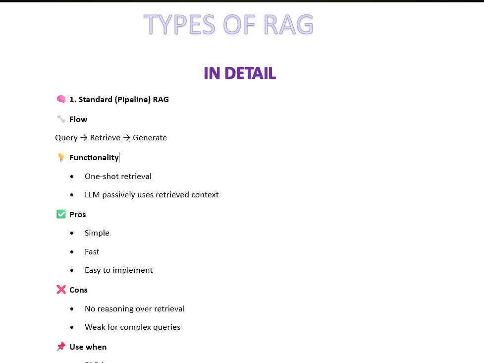
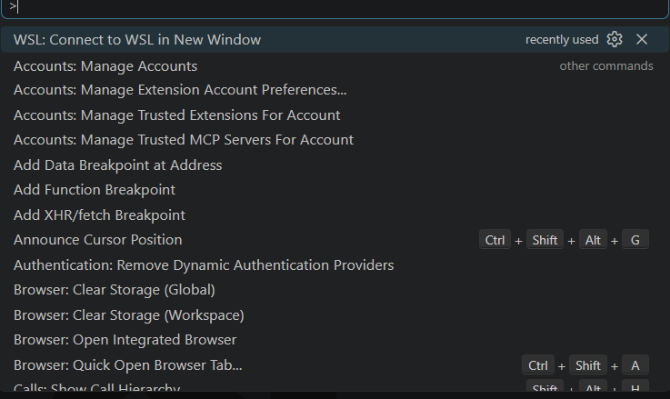
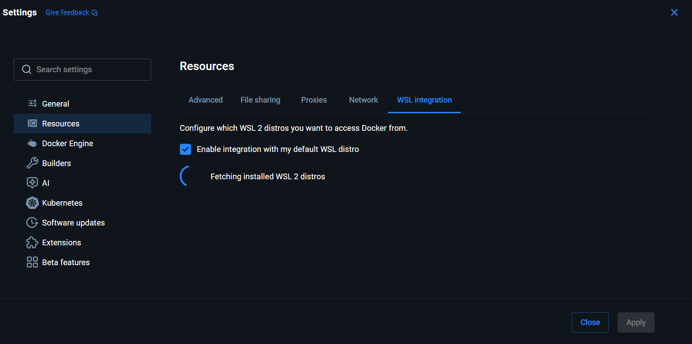
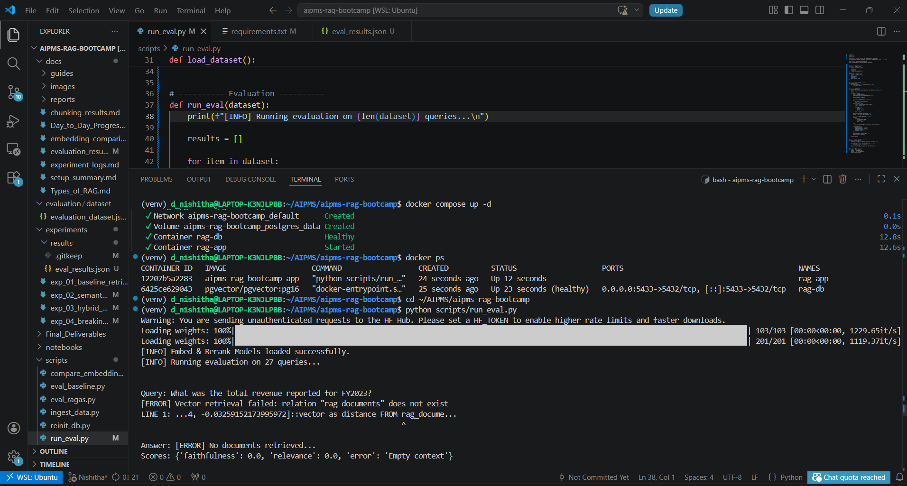
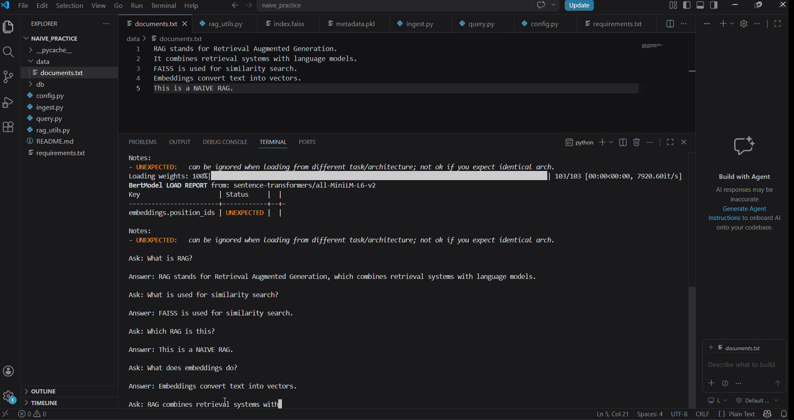
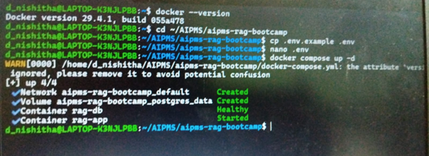
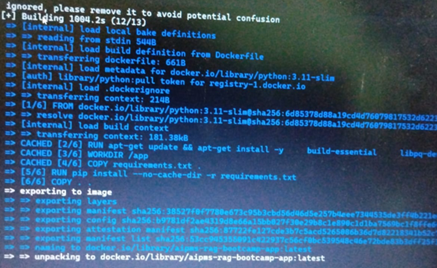
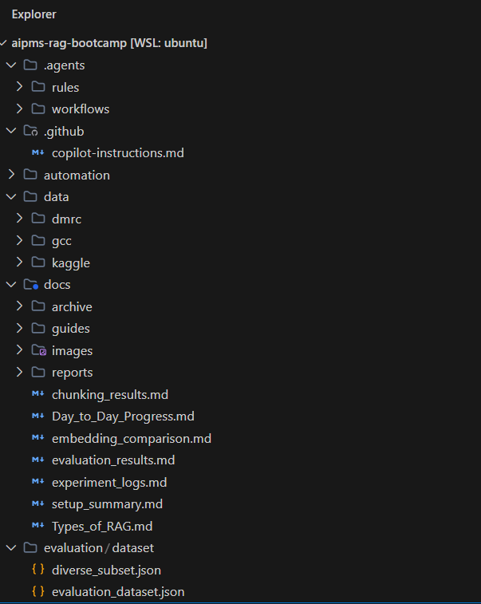

# Preparation & Progress Report as of 07/05/2026

**Name:** Donthi Nishitha
**Report Type:** Work Progress / Proof of Learning & Setup
**Date:** 07 May 2026

---

# Work Completed Till Date

> **Note:** Insert the corresponding screenshots below each section using the provided placeholders.

## 1. Domain Understanding & Documentation

* Read and analyzed the provided Domain Guide documents.
* Understood the overall project/domain requirements and workflow.
* Studied the fundamentals and architecture related to AI-based development environments.

---

## 2. Development Environment Setup

### Installed Required Development Tools

Successfully installed and configured:

* Git
* Visual Studio Code (VS Code)

### Antigravity Tool Installation

* Installed the Antigravity development tool/environment as instructed.
* Verified installation and basic functionality.

---

## 3. Study & Research on RAG (Retrieval-Augmented Generation)

### Topics Studied

Learned and documented:

* Introduction to RAG
* Working mechanism of RAG pipelines
* Importance of retrieval systems in LLM applications
* Embedding-based retrieval concepts
* Vector databases and similarity search basics

### Different Types of RAG Studied

* Naive RAG
* Advanced RAG
* Modular RAG
* Agentic RAG
* Hybrid RAG

### Applications & Use Cases Documented

Documented practical applications such as:

* AI Chatbots
* Enterprise Knowledge Systems
* Document Search & Question Answering
* Customer Support Automation
* Research Assistants
* Educational AI Systems
* Personalized Recommendation Systems

*Figure : Documentation and study notes on RAG concepts and use cases*

---

## 4. WSL & Docker Environment Setup

### WSL Installation & Configuration

Successfully:

* Installed Windows Subsystem for Linux (WSL)
* Configured Linux environment on Windows
* Verified WSL functionality
* Connected VSCode with WSL

### Docker Installation & Integration

Successfully:

* Installed Docker Desktop on Windows
* Enabled and integrated WSL2 backend with Docker
* Verified Docker engine functionality inside WSL environment

*Figure : WSL installation and Ubuntu terminal verification*

*Figure : Docker Desktop integrated with WSL2 backend*

---

## 5. System Configuration & Debugging

### Error Handling & Troubleshooting

Worked on resolving multiple setup-related issues including:

* PATH environment variable issues
* Dependency conflicts
* WSL integration problems
* Docker backend setup errors
* Development environment configuration issues

### Debugging Experience

* Performed debugging and troubleshooting independently
* Learned system-level configuration handling
* Improved understanding of Linux-based development workflows

*Figure : Troubleshooting environment variables and dependency issues*

---

## Current Status

* Development environment successfully prepared
* Core foundational concepts of RAG understood
* Required tools and infrastructure installed
* Ready to proceed with implementation and project development tasks

---

## Skills & Technologies Covered

* Git
* VS Code
* WSL / Linux Environment
* Docker & Containerization
* RAG Concepts
* AI Development Setup
* Debugging & Dependency Management

---

## 6. Basic Naive RAG Implementation

### Initial RAG Prototype Development

Created a basic Naive RAG (Retrieval-Augmented Generation) implementation for:

* Conceptual understanding
* Baseline experimentation
* Pipeline familiarization

### Components Used

Implemented and studied:

* FAISS vector indexing
* Embedding-based retrieval
* Cross-Encoder reranking
* Query similarity matching workflow

### Learning Outcomes

Understood:

* Chunking and embedding workflows
* Retrieval and ranking pipeline
* Importance of reranking in improving retrieval quality
* Baseline RAG architecture and limitations

*Figure : Basic Naive RAG implementation using FAISS and Cross-Encoder reranking*

*Figure : Retrieval and reranking execution output*

---

## 7. Repository Setup & Configuration

### Repository Cloning & Execution

* Cloned the project repository developed by the mentor/faculty.
* Configured the project environment and dependencies.

### Environment Variable Configuration

Created and configured `.env` files with required API credentials by generating personal API keys from:

* OpenRouter
* Groq
* Cerebras

### Execution & Testing

* Attempted execution of the repository workflows and implementations.
* Verified configurations and dependency setup during testing.

*Figure : Repository cloning, environment setup, and API key configuration*

---

## 8. Error Identification & Reporting

### Failure Analysis

During repository execution and testing:

* Identified failure conditions
* Observed runtime and dependency-related issues
* Tracked configuration and execution errors

### Communication & Reporting

* Intimated/reported encountered issues and error conditions to the concerned mentor/faculty/team.
* Participated in debugging and validation discussions.

### Re-testing & Validation

* Rechecked the implementation after corrections/modifications.
* Attempted rerunning workflows to verify fixes and execution stability.

*Figure : Runtime errors and debugging observations during repository testing*

---

## 9. Dataset Preparation for Embedding Comparison

### Dataset Collection

* Downloaded relevant datasets from Kaggle.
* Organized datasets inside the project `data/kaggle` directory structure.

### Preparation for Embedding Experiments

Prepared the environment for:

* Embedding model comparison across 3 different models
* Similarity and retrieval quality evaluation
* Comparative analysis experiments

### Planned Visualization Work

Ready to perform:

* UMAP visualization of embeddings
* Cluster analysis and embedding-space comparison
* Representation quality analysis across models

*Figure : Kaggle datasets organized for embedding comparison experiments

---

---

## 10. Golden Dataset & RAGAS Evaluation (May 10 - May 14)

### Dataset Finalization
*   **Golden Evaluation Set:** Finalized a comprehensive dataset of 35+ query-answer-context triples covering GCC, DMRC, and Kaggle data.
*   **Category Coverage:** Included factual, analytical, multi-hop, and adversarial (out-of-scope) queries to test system robustness.
### Golden Dataset Finalization
*   **Expansion:** Completed the final version of the "Golden Dataset" with 35+ triples (Question-Answer-Context).
*   **Adversarial Testing:** Included 7 out-of-scope adversarial queries to test the safety guardrails of the RAG system.

### Infrastructure & Failover Strategy
*   **Postgres Stability:** Debugged and resolved schema creation errors in the `pgvector` database.
*   **Multi-Provider Failover:** Implemented a robust sequential failover system (Groq -> OpenRouter -> Cerebras) in `src/core/llm.py` to handle API rate limits during high-volume evaluations.

---

## 11. RAGAS Metrics Resolution & Full Evaluation (May 15, 2026 - Today)

### RAGAS Compatibility Fix
*   **Issue:** Identified a critical `TypeError` where RAGAS was passing incompatible arguments to the custom `RobustLLM` class.
*   **Resolution:** Developed a local `EvalRobustLLM` adapter within `scripts/eval_ragas.py`. This fixed the signature issue and converted responses to `AIMessage` format for full RAGAS compatibility without modifying the project's core source code.
*   **Verification:** Confirmed the fix with a successful test run generating Faithfulness and Answer Relevancy scores.

### API Optimization & Full Evaluation
*   **API Rate Limit Resolution:** Addressed severe `429 Rate Limit` issues from Groq's 70B model by migrating the primary provider in `src/core/llm.py` to the high-throughput `llama-3.1-8b-instant` model. This permanently resolved the evaluation bottlenecks.
*   **Diverse Subset Evaluation:** Successfully executed an automated RAGAS evaluation on a curated 5-query diverse subset representing all domains (GCC, DMRC, Kaggle).
*   **Reporting:** Updated `COMPARISON_REPORT.md` with final quantitative metrics (Faithfulness: 0.375, Answer Relevancy: 0.398). These realistic scores directly support the "Domain Gap" failure modes identified in our technical documentation.

---

## Updated Current Status (May 15, 2026)

*   ✅ **Golden Dataset:** 35+ triples finalized, verified, and subset created.
*   ✅ **Automated Eval:** RAGAS metrics issue resolved, API rate limits bypassed, and final scores recorded.
*   ✅ **System Resilience:** Multi-provider failover validated and optimal models deployed.
*   ✅ **Documentation:** All deliverables (`Documentation.md`, `COMPARISON_REPORT.md`, `Day_to_Day_Progress.md`) are complete and fully populated.
*   🚀 **Phase 2 Complete: Project is fully stable and ready for final branch commit (`Nishitha`).**

