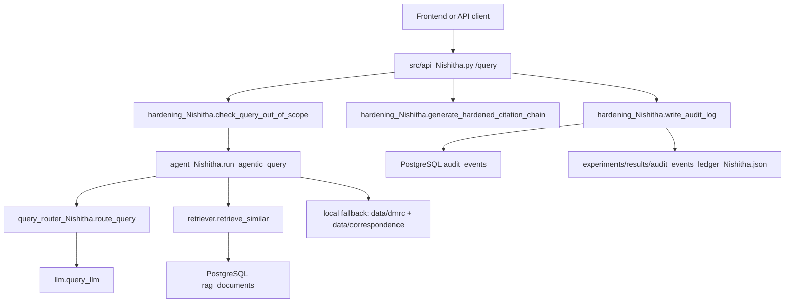

# Repository Restructure Dependency Map

This document maps how the code files in this repo depend on each other, which files are entrypoints, and what paths must be changed if files are moved. It is meant as a practical guide for restructuring the project for easier backend endpoint access, frontend integration, and deployment.

Note: `graphify-out/GRAPH_REPORT.md` was not present when this map was created, so this was built from source imports, script entrypoints, Docker files, and path usage.

## Current Backend Shape

The active backend is a Python RAG service:

```text
FastAPI request
  -> src/api_Nishitha.py
  -> src/core/hardening_Nishitha.py
  -> src/core/agent_Nishitha.py
  -> src/core/query_router_Nishitha.py
  -> src/core/retriever.py
  -> src/core/llm.py
  -> PostgreSQL/pgvector and/or local data fallback
```

Primary API endpoint:

| Method | Path | Handler | Request model | Response model |
| --- | --- | --- | --- | --- |
| `POST` | `/query` | `src/api_Nishitha.py::execute_query` | `QueryRequest` | `QueryResponse` |

Recommended local API command from repo root:

```bash
uvicorn src.api_Nishitha:app --reload
```

## High-Level Runtime Flow



## Core Files And Their Links

| File | Role | Imports / depends on | Used by |
| --- | --- | --- | --- |
| `src/api_Nishitha.py` | FastAPI app and `/query` endpoint | `src.core.agent_Nishitha`, `src.core.hardening_Nishitha`, `fastapi`, `pydantic` | `uvicorn`, `scripts/test_api_Nishitha.py`, frontend clients |
| `src/core/agent_Nishitha.py` | LangGraph agent loop: route, retrieve, evaluate, self-correct, answer | `src.core.llm`, `src.core.query_router_Nishitha`, `src.core.retriever`, `data/dmrc/...`, `data/correspondence/` | `src/api_Nishitha.py`, `scripts/test_agent_Nishitha.py`, `scripts/test_hardening_Nishitha.py` |
| `src/core/query_router_Nishitha.py` | Classifies queries into `contract_clause`, `ncr`, `dpr`, `correspondence` | `src.core.llm` | `src/core/agent_Nishitha.py`, `scripts/test_query_router_Nishitha.py` |
| `src/core/retriever.py` | DB connection, pgvector schema, vector/trigram/hybrid retrieval | `.env` via `dotenv`, `psycopg2`, PostgreSQL tables | `pipeline.py`, `agent_Nishitha.py`, ingestion/eval/test scripts |
| `src/core/hardening_Nishitha.py` | RLS setup, idempotent ingestion, out-of-scope guard, citations, audit log | `src.core.retriever.get_connection`, `experiments/results/...` | `src/api_Nishitha.py`, `scripts/test_hardening_Nishitha.py` |
| `src/core/llm.py` | Multi-provider LLM fallback and LangChain wrapper | API keys from `.env`, OpenAI-compatible clients, optional Gemini/LangChain | Router, agent, pipeline, eval scripts |
| `src/core/pipeline.py` | Baseline RAG pipeline with embeddings, retrieval, reranking, generation | `src.core.retriever`, `src.core.llm`, sentence-transformers | eval scripts, experiments, scratch files |
| `src/core/graph_rag.py` | Taxonomy graph schema and graph retrieval queries | `src.core.retriever.get_connection`, PostgreSQL taxonomy tables | `scripts/ingest_taxonomy.py`, `scripts/demo_graph_rag.py` |
| `src/evals/metrics.py` | Retrieval and generation scoring helpers | `src.core.llm.query_llm` | `scripts/run_eval.py`, `scripts/run_experiments.py`, `scripts/eval_baseline.py` |
| `src/chunkers/ncr_dpr_chunker_BALU.py` | NCR/DPR chunking utilities | standard library only | Intended for chunking scripts |

## Entrypoint Scripts

| Script | What it runs | Depends on | Writes to |
| --- | --- | --- | --- |
| `scripts/ingest_data.py` | Loads PDFs/JSON from `data/` into pgvector | `src.core.retriever`, `src.core.llm`, `SentenceTransformer`, `fitz` | PostgreSQL `rag_documents` |
| `scripts/correspondence_chunker_Nishitha.py` | Parses `data/correspondence/*.txt`, embeds, loads correspondence chunks | `src.core.retriever`, `SentenceTransformer` | PostgreSQL and `experiments/results/correspondence_chunk_test_Nishitha.md` |
| `scripts/ingest_taxonomy.py` | Loads `data/Metro_Rail_Consolidated_Systems_Taxonomy.xlsx` into graph tables | `src.core.graph_rag`, `src.core.retriever`, `pandas` | PostgreSQL `taxonomy_nodes`, `taxonomy_edges` |
| `scripts/demo_graph_rag.py` | Runs graph retrieval benchmark/demo | `src.core.graph_rag`, `src.core.retriever`, `src.core.llm` | `experiments/results/graph_rag_test_Nishitha.md` |
| `scripts/test_api_Nishitha.py` | Uses FastAPI TestClient against the local app object | `src.api_Nishitha.app` | `experiments/results/api_test_Nishitha.md` |
| `scripts/test_agent_Nishitha.py` | Tests the LangGraph agent | `src.core.agent_Nishitha` | `experiments/results/agent_test_Nishitha.md` |
| `scripts/test_hardening_Nishitha.py` | Tests RLS, dedup, fallback, audit/citation logic | `src.core.hardening_Nishitha`, `src.core.agent_Nishitha` | `experiments/results/hardening_test_Nishitha.md` |
| `scripts/test_query_router_Nishitha.py` | Tests query routing | `src.core.query_router_Nishitha` | `experiments/results/query_router_test_Nishitha.md` |
| `scripts/run_experiments.py` | Batch experiment runner with MLflow | `src.core.pipeline`, `src.evals.metrics`, `src.core.retriever` | `experiments/`, `experiments/results/`, MLflow dir |
| `scripts/run_eval.py`, `scripts/eval_baseline.py`, `scripts/eval_ragas.py` | Evaluation runners | `src.core.pipeline`, `src.evals.metrics`, dataset JSON | `experiments/results/` |

## Deployment Files

| File | Role | Important dependency |
| --- | --- | --- |
| `Dockerfile` | Builds Python image, installs `requirements.txt`, copies whole repo to `/app` | Default command is `python scripts/run_experiments.py`, not the FastAPI server |
| `docker-compose.yml` | Starts `db` and `app` services | `app` mounts repo as `/app`, sets `DB_HOST=db`, `DB_PORT=5432` |
| `.env.example` | Example runtime secrets/config | Real `.env` is expected by compose and `dotenv` |
| `requirements.txt` | Core dependencies | Missing runtime deps may exist for FastAPI/LangGraph/RAGAS/Gemini unless installed separately |

For frontend/deployment, the API container command should likely become:

```yaml
command: uvicorn src.api_Nishitha:app --host 0.0.0.0 --port 8000
ports:
  - "8000:8000"
```

## Path Assumptions That Matter When Moving Files

Many files assume they are run from the repo root. If you move files or run from another working directory, these are the first things to fix.

| Current path assumption | Used in | What breaks if moved |
| --- | --- | --- |
| `data/dmrc/dmrc_Synthetic_Dataset_Nishitha.json` | `src/core/agent_Nishitha.py` | Offline fallback retrieval loses DMRC JSON context |
| `data/correspondence/` | `src/core/agent_Nishitha.py`, `scripts/correspondence_chunker_Nishitha.py`, `scripts/create_correspondence_data_Nishitha.py` | Correspondence fallback/chunking stops finding letters |
| `data/` | `scripts/ingest_data.py` default | Ingestion finds no files |
| `data/Metro_Rail_Consolidated_Systems_Taxonomy.xlsx` | `scripts/ingest_taxonomy.py` | GraphRAG taxonomy ingestion fails |
| `evaluation/dataset/evaluation_dataset.json` | eval scripts and HyDE scripts | Evaluations cannot load test cases |
| `experiments/results/` | test/eval/demo scripts, audit JSON fallback | Reports and audit fallback may fail or be written elsewhere |
| `docs/images/` | `scripts/compare_embeddings_Nishitha.py` | UMAP image output path breaks |
| `src.api_Nishitha:app` | README, uvicorn command, frontend backend URL docs | API import path changes |
| `scripts/run_experiments.py` | Dockerfile default `CMD` | Container startup changes |

## Import Assumptions That Matter When Moving Files

The Python package boundary is currently `src`. Most code imports with absolute package names like:

```python
from src.core.retriever import get_connection
from src.core.pipeline import ask_rag
from src.api_Nishitha import app
```

This means:

- Keep `src/` as a package directory if possible.
- If you move backend code into a new folder like `backend/src`, update Docker/uvicorn/test commands so Python can still import the package.
- If you rename `src/api_Nishitha.py`, update `uvicorn src.api_Nishitha:app`, `scripts/test_api_Nishitha.py`, README docs, and any frontend API documentation.
- If you move scripts under another folder, their `sys.path.append(os.path.abspath(os.path.join(os.path.dirname(__file__), '..')))` may no longer point to the repo root.

## Known Broken Or Risky Links

These should be fixed during restructuring:

| File | Issue | Suggested fix |
| --- | --- | --- |
| `tests/test_rag.py` | Imports `src.rag_pipeline`, but no `src/rag_pipeline.py` exists | Change to `from src.core.pipeline import ask_rag` |
| `scripts/chunk_and_save_BALU.py` | Imports `src.chunkers.ncr_dpr_chunker_UDAY`, but available file is `ncr_dpr_chunker_BALU.py` | Change import to `from src.chunkers import ncr_dpr_chunker_BALU as chunker` |
| `scripts/compare_embeddings_Nishitha.py` | Looks for `data/dmrc/dmrc_Synthetic_Dataset.json`; repo has `dmrc_Synthetic_Dataset_Nishitha.json` | Update constant or add config |
| `src/core/agent_Nishitha.py` | In DB retrieval branch, `chunks = [r[0] for r in db_results]` extracts IDs, not content | Should probably use `r[1]` for content chunks |
| `src/api_Nishitha.py` | Imports `retrieve_with_rls` but does not use it in the `/query` route | Either wire real RLS retrieval into the route or remove unused import |
| `Dockerfile` | Starts experiments, not API server | Use an API command for deployment |

## Suggested Restructure For Frontend And Deployment

Keep the Python package stable and group runtime/backend concerns clearly:

```text
backend/
  src/
    api.py
    core/
    evals/
    chunkers/
  scripts/
  tests/
data/
evaluation/
experiments/
docs/
docker/
  Dockerfile
  docker-compose.yml
```

Lower-risk alternative: keep the existing top-level layout and only rename/organize inside `src`:

```text
src/
  api.py                  # formerly api_Nishitha.py
  core/
  chunkers/
  evals/
scripts/
data/
evaluation/
experiments/
```

If you choose the `backend/` layout, update these references together:

1. Docker `WORKDIR`, `COPY`, and `command`.
2. Uvicorn target, for example `uvicorn src.api:app` if `WORKDIR=/app/backend`.
3. Script path fixes from `scripts/...` to `backend/scripts/...`.
4. Hardcoded data/result paths to use a central settings file.
5. Frontend `API_BASE_URL` to point to the deployed FastAPI server.

## Recommended Next Refactor Before Moving Files

Create a single settings/path module first, then move files after imports are clean.

Suggested file:

```text
src/core/settings.py
```

It should expose:

```python
from pathlib import Path

PROJECT_ROOT = Path(__file__).resolve().parents[2]
DATA_DIR = PROJECT_ROOT / "data"
RESULTS_DIR = PROJECT_ROOT / "experiments" / "results"
EVALUATION_DATASET = PROJECT_ROOT / "evaluation" / "dataset" / "evaluation_dataset.json"
CORRESPONDENCE_DIR = DATA_DIR / "correspondence"
DMRC_DATASET = DATA_DIR / "dmrc" / "dmrc_Synthetic_Dataset_Nishitha.json"
TAXONOMY_XLSX = DATA_DIR / "Metro_Rail_Consolidated_Systems_Taxonomy.xlsx"
```

Then replace string paths such as `"data/correspondence"` and `"experiments/results/..."` with these constants. That makes the repo much easier to move or deploy because paths become independent of the current working directory.

## Frontend Integration Notes

Frontend only needs to call the FastAPI service. It does not need to know about RAG internals.

Request:

```http
POST /query
Content-Type: application/json
```

```json
{
  "query": "Who sent the station cavern seepage letter?",
  "tenant_id": "metro_tenant",
  "entity_type_filter": "correspondence"
}
```

Response fields:

```json
{
  "query": "...",
  "tenant_id": "...",
  "answer": "...",
  "citations": "...",
  "confidence": "high",
  "retrieval_trace": [],
  "latency_ms": 123.45
}
```

For deployment, expose only the API service to the frontend. Keep PostgreSQL private inside Docker/network infrastructure.
