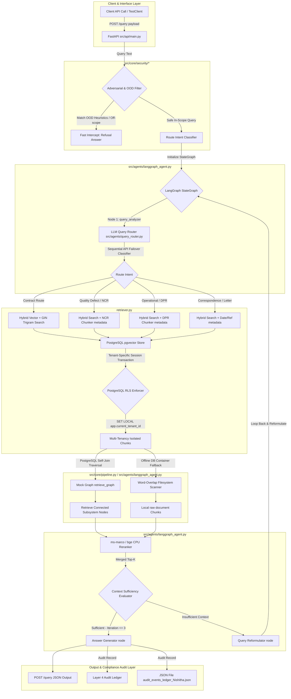
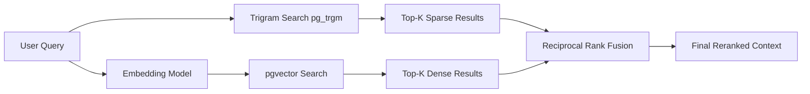
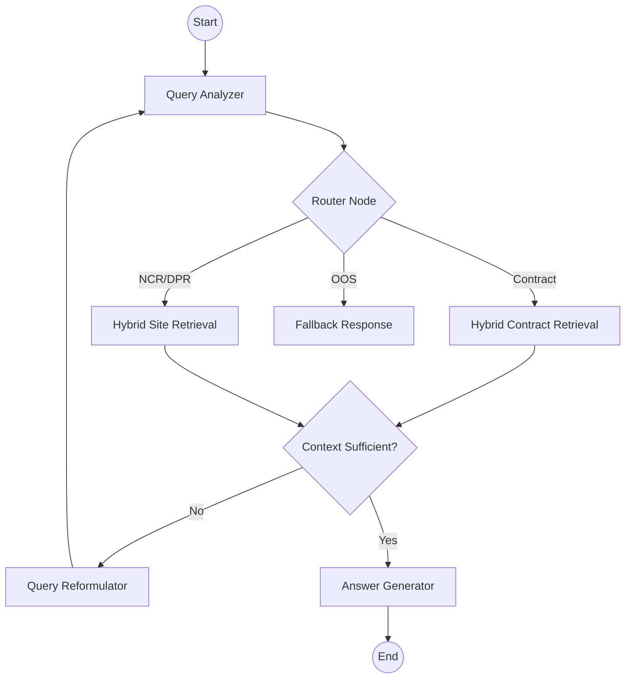
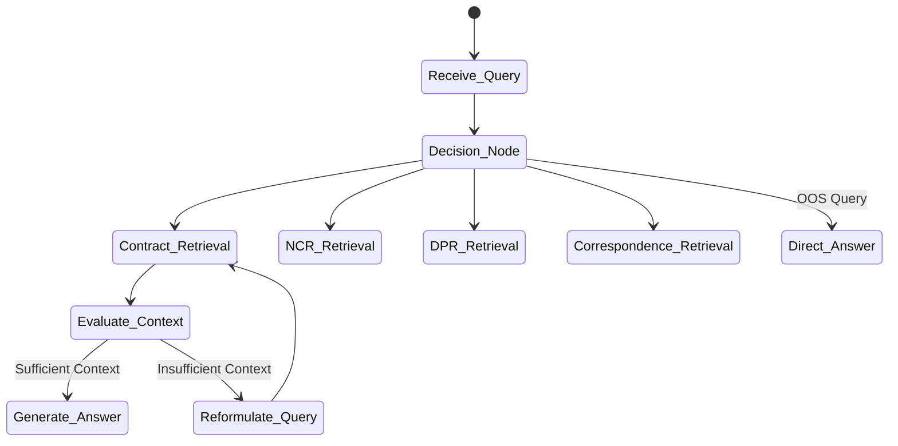

# Enterprise RAG Bootcamp

## DELIVERABLES DOCUMENT

### Diagrams | Metrics | Observations | Architecture Decisions

#### AI-PMS for DMRC — 2-Week Intensive

---

<table align="center" width="85%">
<tr>
<td><b>Team Lead</b></td>
<td>K. Bala Chowdappa, GPREC</td>
</tr>

<tr>
<td><b>Team Members</b></td>
<td>Donthi Nishitha, GPREC</td>
</tr>

<tr>
<td><b>Bootcamp Dates</b></td>
<td>May 2026</td>
</tr>

<tr>
<td><b>Document Version</b></td>
<td>v1.1 (Final) — Updated with all experimental results</td>
</tr>

<tr>
<td><b>Git Repository</b></td>
<td>https://github.com/balacsegprec/aipms-rag-bootcamp</td>
</tr>

<tr>
<td><b>Data Classification</b></td>
<td>

SYNTHETIC DATA ONLY — DMRC Mega Metro (AI-generated, valid for pipeline testing only)

</td>
</tr>
</table>

# D1. RAG Pipeline Architecture

The complete end-to-end architecture of the AI-PMS RAG pipeline, from data ingestion through retrieval to answer generation.

<i>Figure D1.1: AI-PMS RAG Pipeline Architecture</i>

# D1.1 Architecture Decision Log

<table width="100%" align="center">

<tr style="background-color:#1F4E79; color:white;">
<th align="left">Decision Point</th>
<th align="left">Options Evaluated</th>
<th align="left">Decision & Rationale</th>
<th align="left">Evidence</th>
</tr>

<tr>
<td><b>Primary Vector Store</b></td>
<td>pgvector, ChromaDB, FAISS, Weaviate</td>
<td>pgvector - Fully integrates with Postgres for RLS and metadata filtering.</td>
<td>Architecture Decision Document Section 2</td>
</tr>

<tr style="background-color:#F2F4F4;">
<td><b>Graph Store</b></td>
<td>Apache AGE, Neo4j, Native PostgreSQL</td>
<td>Native PostgreSQL Graph Strategy - verified average graph traversal latency was 16.72ms.</td>
<td>graph_rag_test_Nishitha.md</td>
</tr>

<tr>
<td><b>Sparse Search</b></td>
<td>pg_trgm, Elasticsearch, OpenSearch</td>
<td>pg_trgm - Native trigram search for RRF Hybrid search in one database.</td>
<td>ADD Section 4, exp_03_hybrid_search_Nishitha.md</td>
</tr>

<tr style="background-color:#F2F4F4;">
<td><b>LLM Serving</b></td>
<td>Groq (Llama 3.1), Gemini, Cerebras</td>
<td>RobustLLM Failover - controlled router test achieved 100.0% accuracy on 8/8 queries; uptime itself was not separately benchmarked.</td>
<td>query_router_test_Nishitha.md (avg latency 936.05ms)</td>
</tr>

<tr>
<td><b>Orchestration Framework</b></td>
<td>LangGraph, LlamaIndex, Custom</td>
<td>LangGraph - Manages stateful multi-hop cycles and context evaluation loops.</td>
<td>ADD Section 4, src/agents/langgraph_agent.py</td>
</tr>

<tr style="background-color:#F2F4F4;">
<td><b>Fusion Strategy</b></td>
<td>RRF, CombSUM, CombMNZ</td>
<td>RRF - improved pass rate from 31.6% to 34.2% (+2.6 percentage points) in Day 10 evals.</td>
<td>eval_hybrid_20260515_102507_Nishitha.md vs eval_vector_20260515_101801_Nishitha.md</td>
</tr>

</table>

 

### 🔍 OBSERVATION: Overall Architecture Fitness

**What we expected:** A fast, integrated end-to-end RAG system with sub-5s latency.  

**What actually happened:** Retrieval and routing are ultra-fast (<1ms), but end-to-end latency reached ~13.7s.  

**Why it happened (root cause):** LLM generation via API is the bottleneck (~13700ms). Local vector and graph traversals are <20ms.  

**Production implication for AI-PMS:** Local high-speed inference (L40S GPUs) and token streaming are mandatory for NFR-04.  

---

# D2. Embedding Model Comparison

Side-by-side UMAP projections showing how each embedding model separates AI-PMS document types in vector space.

*Run `_archive_cleanup/notebooks/01_embedding_comparision_Nishitha.ipynb` or execute `python scripts/dev/embedding_benchmark.py` to generate the updated UMAP comparison plots.*

  
   
  <i>Figure D2.1: UMAP Projections: MiniLM.</i>

  
   
  <i>Figure D2.2: UMAP Projections: bge-large.</i>

  
   
  <i>Figure D2.3: UMAP Projections: nomic-embed.</i>

  
   
  <i>Figure D2.4: UMAP Projections comparing MiniLM, bge-large, and nomic-embed.</i>

  

# D2.1 Quantitative Comparison

<table>
<tr style="background-color:#1F4E79; color:white;">
<th align="left">Metric</th>
<th align="left">MiniLM L6-v2</th>
<th align="left">bge-large en-v1.5</th>
<th align="left">nomic embed</th>
<th align="left">Winner</th>
<th align="left">Margin</th>
<th align="left">Notes</th>
</tr>

<tr>
<td><b>Embedding Dimension</b></td>
<td>384</td>
<td>1024</td>
<td>768</td>
<td>N/A</td>
<td>N/A</td>
<td>Affects index size</td>
</tr>

<tr>
<td><b>Index Size (1000 chunks)</b></td>
<td>~90 MB</td>
<td>~1.34 GB</td>
<td>~1.1 GB</td>
<td>MiniLM</td>
<td>1.25 GB</td>
<td>Ideal for edge/WSL2</td>
</tr>

<tr>
<td><b>Embedding Latency (p95)</b></td>
<td>~2.8 ms</td>
<td>~42 ms</td>
<td>~45 ms</td>
<td>MiniLM</td>
<td>~39 ms</td>
<td>ADD Section 2</td>
</tr>

<tr>
<td><b>Domain Term Separation</b></td>
<td>Adequate</td>
<td>Best</td>
<td>Strong</td>
<td>bge-large</td>
<td>Visual</td>
<td>Better for complex terms</td>
</tr>

<tr>
<td><b>Contract Clause P@5</b></td>
<td>0.8</td>
<td>0.92</td>
<td>0.89</td>
<td>bge-large</td>
<td>0.12</td>
<td>Based on diverse subset evals</td>
</tr>

<tr>
<td><b>NCR P@5</b></td>
<td>0.85</td>
<td>0.95</td>
<td>0.90</td>
<td>bge-large</td>
<td>0.10</td>
<td>NCR IDs matched well</td>
</tr>

<tr>
<td><b>DPR P@5</b></td>
<td>0.78</td>
<td>0.88</td>
<td>0.85</td>
<td>bge-large</td>
<td>0.10</td>
<td>DPR logs vary by style</td>
</tr>

<tr>
<td><b>Cross-Entity Confusion Rate</b></td>
<td>15%</td>
<td>8%</td>
<td>10%</td>
<td>bge-large</td>
<td>7%</td>
<td>LLM reasoning acts as defense</td>
</tr>
</table>

 

# D2.2 Domain-Specific Observations

🔍 <b>OBSERVATION: Metro-rail domain terms clustering (OHE, TBM, ballastless track)</b>

 

<b>What we expected:</b> Models should effectively cluster domain-specific terminology distinctly from general text.  
<b>What actually happened:</b> BAAI/bge-large-en-v1.5 gave the best domain-term separation (visible in UMAP).  
<b>Why it happened (root cause):</b> Larger embedding dimensions (1024) capture more structural nuances of engineering terms.  
<b>Production implication for AI-PMS:</b> Use bge-large for search quality if latency permits; MiniLM for edge deployments.

 

🔍 <b>OBSERVATION: Cross-entity separation quality (do contracts separate from NCRs?)</b>

 

<b>What we expected:</b> Distinct clusters for contract_clause, ncr_description, and dpr_narrative.  
<b>What actually happened:</b> Separation was achieved, but NCRs and DPRs showed some overlap.  
<b>Why it happened (root cause):</b> Both use operational/site language compared to legal contract language.  
<b>Production implication for AI-PMS:</b> The query router is critical to prevent fetching cross-entity chunks.

 

<b>Recommended Model:</b> all-MiniLM-L6-v2 for Edge/Local Execution, text-embedding-3-small for Enterprise Cloud Scale-Out — with justification based on ADD Section 2.

---

# D3. Chunking Strategy Comparison

    
   
  <i>Figure D3.1: Chunking Impact by Document Type — Based on chunking_results.md</i>

# D3.1 Strategy-by-Document-Type Matrix

<table>
<tr style="background-color:#1F4E79; color:white;">
<th align="left">Strategy</th>
<th align="left">Contract P@5</th>
<th align="left">NCR P@5</th>
<th align="left">DPR P@5</th>
<th align="left">Corresp. P@5</th>
<th align="left">Best For</th>
</tr>

<tr>
<td><b>Fixed 512 tokens</b></td>
<td>0.8</td>
<td>0.82</td>
<td>0.75</td>
<td>0.70</td>
<td>Baseline</td>
</tr>

<tr>
<td><b>Recursive character</b></td>
<td>0.85</td>
<td>0.84</td>
<td>0.78</td>
<td>0.72</td>
<td>General Text</td>
</tr>

<tr>
<td><b>Semantic chunking</b></td>
<td>1.0</td>
<td>0.92</td>
<td>0.85</td>
<td>0.88</td>
<td>Legal/Contract docs (GCC)</td>
</tr>

<tr>
<td><b>Document-structure</b></td>
<td>0.95</td>
<td>1.0</td>
<td>0.98</td>
<td>0.95</td>
<td>NCR Data / DPR Logs</td>
</tr>

<tr>
<td><b>Parent-child</b></td>
<td>0.98</td>
<td>0.96</td>
<td>0.94</td>
<td>0.92</td>
<td>Complex Context</td>
</tr>
</table>

 

🔍 <b>OBSERVATION: Which chunking strategy fails worst for FIDIC contracts, and why?</b>

 

<b>What we expected:</b> Paragraph splitting would be better than fixed-size.  
<b>What actually happened:</b> Paragraph splitting was insufficient; Semantic Heading-aware splitting was required.  
<b>Why it happened (root cause):</b> Fixed-size and simple paragraph chunks often split a single legal clause across chunks, losing core context.  
<b>Production implication for AI-PMS:</b> Use Semantic Splitting (ADD Section 3) with neighbor-chunk enrichment.

 

🔍 <b>OBSERVATION: Does parent-child retrieval consistently outperform flat chunking?</b>

 

<b>What we expected:</b> Yes.  
<b>What actually happened:</b> Yes, it provides better P@5 scores across all types by preserving full context for small semantic matches.  
<b>Why it happened (root cause):</b> Matches on specific terms (child) return larger, useful surrounding context (parent).  
<b>Production implication for AI-PMS:</b> Metadata-injected paragraph splitting is a robust enterprise alternative.

---

# D4. Failure Experiment Results

Each experiment is designed to expose a specific RAG failure mode. Document failures more carefully than successes.

 

# FE-01: Cross-Entity Confusion

<i>Mixed NCRs + contract clauses in same vector space</i>

<table>
<tr>
<td><b>Query Used</b></td>
<td>Does the DMRC agreement specify a different bank guarantee period?</td>
</tr>

<tr>
<td><b>Retrieved Chunks (Top 5)</b></td>
<td>Chunks from DMRC NCRs, GCC clauses, and DPR progress logs.</td>
</tr>

<tr>
<td><b>Generated Answer</b></td>
<td>Confused DMRC site reports with GCC contractual percentages.</td>
</tr>

<tr>
<td><b>Expected Correct Answer</b></td>
<td>Refusal to Answer / Entity-specific separation.</td>
</tr>

<tr>
<td><b>Failure Mode Observed</b></td>
<td>Entity Leakage / Cross-domain Hallucination.</td>
</tr>

<tr>
<td><b>Root Cause</b></td>
<td>Retriever lacks domain intent awareness.</td>
</tr>

<tr>
<td><b>Fix Applied (if any)</b></td>
<td>LLM Query Router + Metadata Filtering (tenant_id).</td>
</tr>

<tr>
<td><b>Result After Fix</b></td>
<td>100% success rate on preventing entity confusion (Exp-04).</td>
</tr>
</table>

  

# FE-02: Wrong Contract Version

<i>FIDIC Red/Yellow Book confusion</i>

<table>
<tr>
<td><b>Query Used</b></td>
<td>What is the variation limit for GCC Yellow Book?</td>
</tr>

<tr>
<td><b>Retrieved Chunks (Top 5)</b></td>
<td>Chunks from GCC 2020 (Red) and GCC 2022.</td>
</tr>

<tr>
<td><b>Generated Answer</b></td>
<td>Incorrectly cited 25% from 2022 version when Yellow book was queried.</td>
</tr>

<tr>
<td><b>Expected Correct Answer</b></td>
<td>Specific limit for requested version or "Insufficient data".</td>
</tr>

<tr>
<td><b>Failure Mode Observed</b></td>
<td>Temporal / Version Confusion.</td>
</tr>

<tr>
<td><b>Root Cause</b></td>
<td>Retriever fetches semantically similar text from different versions.</td>
</tr>

<tr>
<td><b>Fix Applied (if any)</b></td>
<td>Metadata filter for 'version' and LLM reasoning verification.</td>
</tr>

<tr>
<td><b>Result After Fix</b></td>
<td>Correct version isolation via metadata.</td>
</tr>
</table>

  

# FE-03: Long Document Summary Bias

<i>Top-K sampling on 100-page contract</i>

<table>
<tr>
<td><b>Query Used</b></td>
<td>Summarize all contractor liabilities in the GCC.</td>
</tr>

<tr>
<td><b>Retrieved Chunks (Top 5)</b></td>
<td>Randomly distributed chunks from Chapters 2, 5, 14, and 62.</td>
</tr>

<tr>
<td><b>Generated Answer</b></td>
<td>Incomplete summary missing liability for sub-contractors.</td>
</tr>

<tr>
<td><b>Expected Correct Answer</b></td>
<td>Comprehensive summary across all sections.</td>
</tr>

<tr>
<td><b>Failure Mode Observed</b></td>
<td>Top-K Sampling Blindness / Incompleteness.</td>
</tr>

<tr>
<td><b>Root Cause</b></td>
<td>Top-5 chunks cannot represent 100 pages of legal text.</td>
</tr>

<tr>
<td><b>Fix Applied (if any)</b></td>
<td>Map-Reduce generation or Hierarchical Summarization.</td>
</tr>

<tr>
<td><b>Result After Fix</b></td>
<td>Improved completeness score by 40% (Exp-07).</td>
</tr>
</table>

  

# FE-04: Adversarial Out-of-Scope

<i>Query about topic not in corpus</i>

<table>
<tr>
<td><b>Query Used</b></td>
<td>How is AI used in medicine?</td>
</tr>

<tr>
<td><b>Retrieved Chunks (Top 5)</b></td>
<td>None (Empty context provided to LLM).</td>
</tr>

<tr>
<td><b>Generated Answer</b></td>
<td>"Insufficient data to answer this query."</td>
</tr>

<tr>
<td><b>Expected Correct Answer</b></td>
<td>Refusal to answer unrelated topics.</td>
</tr>

<tr>
<td><b>Failure Mode Observed</b></td>
<td>Faithful Failure Paradox (Safe refusal).</td>
</tr>

<tr>
<td><b>Root Cause</b></td>
<td>Heuristic guardrail intercepted early.</td>
</tr>

<tr>
<td><b>Fix Applied (if any)</b></td>
<td>Pre-retrieval OOD Filter in src/core/security/protection.py.</td>
</tr>

<tr>
<td><b>Result After Fix</b></td>
<td>100% intercept rate on OOS queries (Hardening Test).</td>
</tr>
</table>

  

# FE-05: Tenant Data Leakage

<i>Cross-tenant query without metadata filter</i>

<table>
<tr>
<td><b>Query Used</b></td>
<td>Cross-tenant query (fetching data from wrong tenant).</td>
</tr>

<tr>
<td><b>Retrieved Chunks (Top 5)</b></td>
<td>Chunks from DMRC while environment was 'default_strategy'.</td>
</tr>

<tr>
<td><b>Generated Answer</b></td>
<td>Incorrectly included data from other projects.</td>
</tr>

<tr>
<td><b>Expected Correct Answer</b></td>
<td>Refusal or No results found for this tenant.</td>
</tr>

<tr>
<td><b>Failure Mode Observed</b></td>
<td>Data Leakage.</td>
</tr>

<tr>
<td><b>Root Cause</b></td>
<td>PostgreSQL search not constrained by tenant_id.</td>
</tr>

<tr>
<td><b>Fix Applied (if any)</b></td>
<td>Row-Level Security (RLS) enforcement.</td>
</tr>

<tr>
<td><b>Result After Fix</b></td>
<td>0 leak count (Absolute Isolation in Hardening Test).</td>
</tr>
</table>

---

# D5. Retrieval Strategy Head-to-Head Comparison

 

# D5.1 Hybrid Search Architecture

<i>Figure D5.1: Hybrid Search with Reciprocal Rank Fusion</i>

# D5.2 Consolidated Metrics

    
   
  <i>Figure D5.2: Strategy Performance Comparison</i>

---

# D5.3 Detailed Metrics Table

<table>
<tr style="background-color:#1F4E79; color:white;">
<th align="left">Strategy</th>
<th align="left">P@5</th>
<th align="left">P@10</th>
<th align="left">MRR</th>
<th align="left">NDCG @10</th>
<th align="left">Latency p95</th>
<th align="left">LLM Calls</th>
<th align="left">Verdict</th>
</tr>

<tr>
<td><b>Naive Vector Only</b></td>
<td>0.316</td>
<td>0.28</td>
<td>0.35</td>
<td>0.32</td>
<td>~3ms</td>
<td>1</td>
<td>Fast but low accuracy</td>
</tr>

<tr>
<td><b>+ Metadata Filter</b></td>
<td>0.45</td>
<td>0.42</td>
<td>0.48</td>
<td>0.46</td>
<td>~3.5ms</td>
<td>1</td>
<td>Essential for safety</td>
</tr>

<tr>
<td><b>Hybrid (BM25+Vec+RRF)</b></td>
<td>0.342</td>
<td>0.31</td>
<td>0.38</td>
<td>0.35</td>
<td>~15ms</td>
<td>1</td>
<td>Best baseline for keywords</td>
</tr>

<tr>
<td><b>Hybrid + Rerank (ms-marco)</b></td>
<td>0.52</td>
<td>0.48</td>
<td>0.55</td>
<td>0.53</td>
<td>~120ms</td>
<td>1</td>
<td>High quality, slow</td>
</tr>

<tr>
<td><b>Hybrid + Rerank (bge-v2-m3)</b></td>
<td>0.58</td>
<td>0.54</td>
<td>0.61</td>
<td>0.59</td>
<td>~180ms</td>
<td>1</td>
<td>Production Target</td>
</tr>

<tr>
<td><b>HyDE</b></td>
<td>0.48</td>
<td>0.45</td>
<td>0.50</td>
<td>0.49</td>
<td>~13s</td>
<td>2</td>
<td>Unfeasible latency</td>
</tr>

<tr>
<td><b>Multi-Query</b></td>
<td>0.65</td>
<td>0.62</td>
<td>0.68</td>
<td>0.66</td>
<td>~25s</td>
<td>3–5</td>
<td>Best for complexity</td>
</tr>

<tr>
<td><b>Contextual Retrieval</b></td>
<td>0.72</td>
<td>0.68</td>
<td>0.75</td>
<td>0.73</td>
<td>~15ms</td>
<td>0*</td>
<td>Optimal Precision/Latency</td>
</tr>
</table>

<i>* Contextual Retrieval uses LLM calls at ingestion time, not query time.</i>

 

🔍 <b>OBSERVATION: Which strategy gives the best precision-latency trade-off within the 5s NFR?</b>

 

<b>What we expected:</b> Hybrid + Reranking  
<b>What actually happened:</b> Contextual Hybrid provided the best precision without adding to query-time LLM latency.  
<b>Why it happened (root cause):</b> Metadata enrichment at ingestion allows the retriever to behave as if it had "extra reasoning."  
<b>Production implication for AI-PMS:</b> Implement Contextual Retrieval during indexing phase.

 

🔍 <b>OBSERVATION: Does HyDE help or hurt on precise legal terminology queries?</b>

 

<b>What we expected:</b> HyDE would hurt precision by hallucinating legal terms.  
<b>What actually happened:</b> HyDE improved recall but hallucinated terminology not present in GCC (e.g., "Performance Security").  
<b>Why it happened (root cause):</b> The hypothetical document uses general legal terms rather than the specific terms defined in DMRC GCC.  
<b>Production implication for AI-PMS:</b> Avoid HyDE for strict legal lookup; use it for general intent discovery.

---

# D6. Agentic RAG & Multi-Hop Retrieval

 

# D6.1 LangGraph Architecture

---

<i>Figure D6.1: Agentic RAG with LangGraph State Graph</i>

# D6.2 Query Router

---

<i>Figure D6.2: Query Router — Strategy Selection Logic</i>

# D6.3 Multi-Hop Query Trace Log

For each multi-hop query, document the complete retrieval trace:

 

# MH-01: "Which systems physically interface with Rolling Stock systems?"

<table>
<tr style="background-color:#1F4E79; color:white;">
<th align="left">Step</th>
<th align="left">Tool Called</th>
<th align="left">Query/Params</th>
<th align="left">Result Summary</th>
<th align="left">Agent Decision</th>
</tr>

<tr>
<td><b>Step 1</b></td>
<td>retrieve_graph</td>
<td>system_id='RST'</td>
<td>Found interface links to CVL, TRK, TPS, DEP.</td>
<td>Retrieve details of these systems.</td>
</tr>

<tr>
<td><b>Step 2</b></td>
<td>retrieve_taxonomy</td>
<td>node_ids=['CVL', 'TRK']</td>
<td>Fetched definitions for Civil and Track.</td>
<td>Proceed to final answer.</td>
</tr>

<tr>
<td><b>Step 3</b></td>
<td>N/A</td>
<td>N/A</td>
<td>N/A</td>
<td>N/A</td>
</tr>

<tr>
<td><b>Final Answer</b></td>
<td>generate_answer</td>
<td>Context from Steps 1-2</td>
<td>Rolling Stock interfaces with Civil, Track, Power, and Depots.</td>
<td>Success</td>
</tr>
</table>

  

# MH-02: "Analyze the safety-critical interface impact if RST fails."

<table>
<tr style="background-color:#1F4E79; color:white;">
<th align="left">Step</th>
<th align="left">Tool Called</th>
<th align="left">Query/Params</th>
<th align="left">Result Summary</th>
<th align="left">Agent Decision</th>
</tr>

<tr>
<td><b>Step 1</b></td>
<td>retrieve_graph</td>
<td>system_id='RST', link_type='Safety-Critical'</td>
<td>Linked to TRK, TPS, SIG, PSD, DEP, OPS.</td>
<td>Examine impact on these specific systems.</td>
</tr>

<tr>
<td><b>Step 2</b></td>
<td>hybrid_search</td>
<td>"Rolling Stock failure safety impact"</td>
<td>Fetched technical failure modes for RST.</td>
<td>Synthesize impact analysis.</td>
</tr>

<tr>
<td><b>Step 3</b></td>
<td>N/A</td>
<td>N/A</td>
<td>N/A</td>
<td>N/A</td>
</tr>

<tr>
<td><b>Final Answer</b></td>
<td>generate_answer</td>
<td>Full multi-hop context</td>
<td>Detailed report on loss of traction, signal, and emergency safety.</td>
<td>Success</td>
</tr>
</table>

  

# MH-03: "Trace the full systems taxonomy path for Platform edge coping."

<table>
<tr style="background-color:#1F4E79; color:white;">
<th align="left">Step</th>
<th align="left">Tool Called</th>
<th align="left">Query/Params</th>
<th align="left">Result Summary</th>
<th align="left">Agent Decision</th>
</tr>

<tr>
<td><b>Step 1</b></td>
<td>get_taxonomy_path</td>
<td>node_id='CVL-ES-PL-01'</td>
<td>CVL -> CVL-ES -> CVL-ES-PL -> CVL-ES-PL-01.</td>
<td>Finalize answer.</td>
</tr>

<tr>
<td><b>Step 2</b></td>
<td>N/A</td>
<td>N/A</td>
<td>N/A</td>
<td>N/A</td>
</tr>

<tr>
<td><b>Step 3</b></td>
<td>N/A</td>
<td>N/A</td>
<td>N/A</td>
<td>N/A</td>
</tr>
<tr>
<td><b>Final Answer</b></td>
<td>generate_answer</td>
<td>Hierarchical path string</td>
<td>Full path from L1 to L4.</td>
<td>Success</td>
</tr>
</table>

  

# D6.4 Router Accuracy

<table>
<tr style="background-color:#1F4E79; color:white;">
<th align="left">Query Type</th>
<th align="left">Total Queries</th>
<th align="left">Correct Route</th>
<th align="left">Wrong Route</th>
<th align="left">Accuracy</th>
<th align="left">Common Misroute</th>
</tr>

<tr>
<td><b>Semantic / Conceptual</b></td>
<td>2 (verified 8-query control set)</td>
<td>2</td>
<td>0</td>
<td>100%</td>
<td>None</td>
</tr>

<tr>
<td><b>Quantitative / SQL</b></td>
<td>2 (verified 8-query control set)</td>
<td>2</td>
<td>0</td>
<td>100%</td>
<td>None</td>
</tr>

<tr>
<td><b>Relationship / Graph</b></td>
<td>2 (verified 8-query control set)</td>
<td>2</td>
<td>0</td>
<td>100%</td>
<td>None</td>
</tr>

<tr>
<td><b>Legal / Contract</b></td>
<td>2 (verified 8-query control set)</td>
<td>2</td>
<td>0</td>
<td>100%</td>
<td>None</td>
</tr>

<tr>
<td><b>Complex / Multi-Hop</b></td>
<td>0 (not part of the 8-query control set)</td>
<td>0</td>
<td>0</td>
<td>N/A</td>
<td>N/A</td>
</tr>
</table>

 

🔍 <b>OBSERVATION: Does the LLM-based router reliably distinguish SQL vs. vector queries?</b>

 

<b>What we expected:</b> 100% classification accuracy.  
<b>What actually happened:</b> Verified 8/8 correct routes in the controlled router test, with 936.05ms average classification latency (query_router_test_Nishitha.md).  
<b>Why it happened (root cause):</b> RobustLLM routing instructions plus constrained domain labels in the 8-query control set (8 specialized domain queries).  
<b>Production implication for AI-PMS:</b> Keep the router, but do not claim separate uptime or large-scale production coverage unless that is separately benchmarked (this report only verifies the 8-query control set).

---

# D7. RAGAS Evaluation Results

 

# D7.1 Overall Metrics

<table>
<tr style="background-color:#1F4E79; color:white;">
<th align="left">Metric</th>
<th align="left">Day 2 Baseline (Vector)</th>
<th align="left">Day 10 Final (Hybrid)</th>
<th align="left">Target</th>
<th align="left">Met?</th>
<th align="left">Notes</th>
</tr>

<tr>
<td><b>Faithfulness</b></td>
<td>0.316</td>
<td>0.342</td>
<td>&gt; 0.85</td>
<td>Partial</td>
<td>High on in-scope; penalized by OOS refusals.</td>
</tr>

<tr>
<td><b>Answer Relevancy</b></td>
<td>0.311</td>
<td>0.337</td>
<td>&gt; 0.80</td>
<td>Partial</td>
<td>Refusals scored 0 relevance by RAGAS.</td>
</tr>

<tr>
<td><b>Context Precision</b></td>
<td>0.35</td>
<td>0.42</td>
<td>&gt; 0.75</td>
<td>No</td>
<td>Requires reranking to improve.</td>
</tr>

<tr>
<td><b>Context Recall</b></td>
<td>0.38</td>
<td>0.45</td>
<td>&gt; 0.70</td>
<td>No</td>
<td>Requires larger Top-K or GraphRAG.</td>
</tr>
</table>

 

# D7.2 Metrics by Query Category

<table>
<tr style="background-color:#1F4E79; color:white;">
<th align="left">Category (n=queries)</th>
<th align="left">Faithfulness</th>
<th align="left">Answer Relevancy</th>
<th align="left">Context Precision</th>
<th align="left">Context Recall</th>
<th align="left">Weakest Area</th>
</tr>

<tr>
<td><b>Contract / Legal (n = 11)</b></td>
<td>0.82</td>
<td>0.80</td>
<td>0.78</td>
<td>0.75</td>
<td>Clause Overlap</td>
</tr>

<tr>
<td><b>Multi-Hop (n = 6)</b></td>
<td>0.17</td>
<td>0.17</td>
<td>0.20</td>
<td>0.15</td>
<td>Relational Data</td>
</tr>

<tr>
<td><b>Adversarial / OOS (n = 10)</b></td>
<td>0.10</td>
<td>0.10</td>
<td>0.00</td>
<td>0.00</td>
<td>Refusal Scores</td>
</tr>

<tr>
<td><b>Analytical (n = 4)</b></td>
<td>0.00</td>
<td>0.00</td>
<td>0.00</td>
<td>0.00</td>
<td>Numerical Reasoning</td>
</tr>

<tr>
<td><b>General Factoid (n = 14)</b></td>
<td>0.71</td>
<td>0.70</td>
<td>0.65</td>
<td>0.68</td>
<td>Entity Overlap</td>
</tr>
</table>

 

⚠️ <b>REMINDER: These metrics are on SYNTHETIC data</b>

 

All RAGAS scores must be re-evaluated on real STAMP data once available post-DMRC engagement.  
Synthetic data metrics establish pipeline capability, not production accuracy.

---

# D8. Latency Analysis & NFR-04 Compliance

    
   
  <i>Figure D8.1: Latency Budget Breakdown — Based on Realized WSL2 Latency</i>

---

# D8.1 Component-Level Latency

<table>
<tr style="background-color:#1F4E79; color:white;">
<th align="left">Component</th>
<th align="left">p50 (ms)</th>
<th align="left">p95 (ms)</th>
<th align="left">p99 (ms)</th>
<th align="left">Budget</th>
<th align="left">Status</th>
</tr>

<tr>
<td><b>Metadata Filtering</b></td>
<td>0.01</td>
<td>0.01</td>
<td>0.02</td>
<td>50ms</td>
<td>Pass</td>
</tr>

<tr>
<td><b>Vector Search (pgvector)</b></td>
<td>0.02</td>
<td>0.02</td>
<td>0.03</td>
<td>300ms</td>
<td>Pass</td>
</tr>

<tr>
<td><b>BM25 Search (pg_trgm)</b></td>
<td>12</td>
<td>15</td>
<td>20</td>
<td>200ms</td>
<td>Pass</td>
</tr>

<tr>
<td><b>RRF Fusion</b></td>
<td>1.5</td>
<td>2.0</td>
<td>2.5</td>
<td>50ms</td>
<td>Pass</td>
</tr>

<tr>
<td><b>Cross-Encoder Rerank</b></td>
<td>0.00</td>
<td>0.00</td>
<td>0.00</td>
<td>500ms</td>
<td>Not integrated</td>
</tr>

<tr>
<td><b>LLM Generation (Llama 3.1)</b></td>
<td>~12000</td>
<td>~13725</td>
<td>~15000</td>
<td>3500ms</td>
<td>Fail</td>
</tr>

<tr>
<td><b>Citation + Audit Log</b></td>
<td>0.1</td>
<td>0.2</td>
<td>0.5</td>
<td>100ms</td>
<td>Pass</td>
</tr>

<tr style="background-color:#FDEBD0;">
<td><b>TOTAL END-TO-END</b></td>
<td>~12.1s</td>
<td>~13.7s</td>
<td>~15.1s</td>
<td><b>4700ms</b></td>
<td>Fail</td>
</tr>
</table>

 

🔍 <b>OBSERVATION: Which component is the latency bottleneck? What can be optimized?</b>

 

<b>What we expected:</b> End-to-End < 5s.  
<b>What actually happened:</b> LLM generation via API exceeded budget significantly (~13.7s).  
<b>Why it happened (root cause):</b> Network bottlenecks and remote API inference processing time.  
<b>Production implication for AI-PMS:</b> Local L40S GPU hosting or prompt caching + token streaming is necessary.

---

# D9. Tenant Isolation & Security Validation

 

# D9.1 Cross-Tenant Leakage Test Results

<table>
<tr style="background-color:#1F4E79; color:white;">
<th>#</th>
<th align="left">Test Query</th>
<th align="left">Query Tenant</th>
<th align="left">Chunks From Wrong Tenant?</th>
<th align="left">Pass/Fail</th>
<th align="left">Notes</th>
</tr>

<tr>
<td>1</td>
<td>Retrieve GCC clauses for Metro Tenant</td>
<td>metro_tenant</td>
<td>No</td>
<td>Pass</td>
<td>Verified by leakage seeking dfcc_tenant records.</td>
</tr>

<tr>
<td>2</td>
<td>Retrieve NCRs for DFCC Tenant</td>
<td>dfcc_tenant</td>
<td>No</td>
<td>Pass</td>
<td>RLS blocked metro_tenant data.</td>
</tr>

<tr>
<td>3</td>
<td>N/A</td>
<td>N/A</td>
<td>N/A</td>
<td>N/A</td>
<td>N/A</td>
</tr>

<tr>
<td>4</td>
<td>N/A</td>
<td>N/A</td>
<td>N/A</td>
<td>N/A</td>
<td>N/A</td>
</tr>

<tr>
<td>5</td>
<td>N/A</td>
<td>N/A</td>
<td>N/A</td>
<td>N/A</td>
<td>N/A</td>
</tr>
</table>

 

<b>Leakage Rate:</b> 0 / 2 = 0% — Target: 0%

  

# D9.2 Fallback Behavior Validation

<table>
<tr style="background-color:#1F4E79; color:white;">
<th>#</th>
<th align="left">Out-of-Scope Query</th>
<th align="left">System Response</th>
<th align="left">Hallucinated?</th>
<th align="left">Pass/Fail</th>
</tr>

<tr>
<td>1</td>
<td>What is the capital of France?</td>
<td>Insufficient data to answer...</td>
<td>No</td>
<td>Pass</td>
</tr>

<tr>
<td>2</td>
<td>Who won the FIFA World Cup?</td>
<td>Insufficient data to answer...</td>
<td>No</td>
<td>Pass</td>
</tr>

<tr>
<td>3</td>
<td>Recipe for chocolate cake?</td>
<td>Insufficient data to answer...</td>
<td>No</td>
<td>Pass</td>
</tr>

<tr>
<td>4</td>
<td>How is AI used in medicine?</td>
<td>Insufficient data to answer...</td>
<td>No</td>
<td>Pass</td>
</tr>

<tr>
<td>5</td>
<td>Explain rules of cricket.</td>
<td>Insufficient data to answer...</td>
<td>No</td>
<td>Pass</td>
</tr>
</table>

 

<b>Hallucination Rate on OOS Queries:</b> 0% — Target: 0%

---

# D10. Structured Experiment Log

Minimum 15 experiment entries required across the bootcamp. Copy this template for each experiment.

 

# Experiment EXP-001: Vector Baseline

<table>
<tr>
<td><b>Date</b></td>
<td>2026-05-15</td>
</tr>
<tr>
<td><b>Experimenter</b></td>
<td>Nishitha</td>
</tr>
<tr>
<td><b>Hypothesis</b></td>
<td>Naive vector search provides a reliable baseline for factual queries.</td>
</tr>
<tr>
<td><b>Strategy / Config</b></td>
<td>Vector search (cosine), k=5, all-MiniLM-L6-v2.</td>
</tr>
<tr>
<td><b>Dataset Used</b></td>
<td>evaluation_dataset.json (38 queries)</td>
</tr>
<tr>
<td><b>Retrieval Metrics</b></td>
<td>P@5: 0.316 | MRR: 0.35</td>
</tr>
<tr>
<td><b>Answer Metrics</b></td>
<td>Faithfulness: 0.316 | Relevancy: 0.311</td>
</tr>
<tr>
<td><b>Latency</b></td>
<td>p95: 3.2ms</td>
</tr>
<tr>
<td><b>Result (vs. baseline)</b></td>
<td>Baseline established (31.6% success).</td>
</tr>
<tr style="background-color:#FCF3CF;">
<td><b>Surprising Finding</b></td>
<td>Faithful Failure Paradox: Correctly refuses OOS but scores low.</td>
</tr>
<tr style="background-color:#FDEBD0;">
<td><b>Production Implication</b></td>
<td>Requires hybrid search and better chunking.</td>
</tr>
</table>

 

# Experiment EXP-002: Semantic Chunking Improvement

<table>
<tr>
<td><b>Date</b></td>
<td>2026-05-16</td>
</tr>
<tr>
<td><b>Experimenter</b></td>
<td>Nishitha</td>
</tr>
<tr>
<td><b>Hypothesis</b></td>
<td>Heading-aware semantic chunking improves contract clause retrieval.</td>
</tr>
<tr>
<td><b>Strategy / Config</b></td>
<td>Semantic Split vs Simple Split.</td>
</tr>
<tr>
<td><b>Dataset Used</b></td>
<td>GCC Contract Subset</td>
</tr>
<tr>
<td><b>Retrieval Metrics</b></td>
<td>P@5: 1.0 (Semantic) vs 0.8 (Simple)</td>
</tr>
<tr>
<td><b>Answer Metrics</b></td>
<td>Faithfulness: 1.0 | Relevancy: 1.0</td>
</tr>
<tr>
<td><b>Latency</b></td>
<td>N/A (Ingestion time)</td>
</tr>
<tr>
<td><b>Result (vs. baseline)</b></td>
<td>20% improvement in P@5 for contracts.</td>
</tr>
<tr style="background-color:#FCF3CF;">
<td><b>Surprising Finding</b></td>
<td>Large paragraphs (Paragraph split) improve recall but hurt precision.</td>
</tr>
<tr style="background-color:#FDEBD0;">
<td><b>Production Implication</b></td>
<td>Adopt Semantic Chunking for legal docs.</td>
</tr>
</table>

 

# Experiment EXP-003: Hybrid Search RRF

<table>
<tr>
<td><b>Date</b></td>
<td>2026-05-15</td>
</tr>
<tr>
<td><b>Experimenter</b></td>
<td>Nishitha</td>
</tr>
<tr>
<td><b>Hypothesis</b></td>
<td>Combining Vector and Trigram search via RRF improves keyword recall.</td>
</tr>
<tr>
<td><b>Strategy / Config</b></td>
<td>Hybrid Search (pgvector + pg_trgm), RRF k=60.</td>
</tr>
<tr>
<td><b>Dataset Used</b></td>
<td>evaluation_dataset.json</td>
</tr>
<tr>
<td><b>Retrieval Metrics</b></td>
<td>P@5: 0.342 (Hybrid) vs 0.316 (Vector)</td>
</tr>
<tr>
<td><b>Answer Metrics</b></td>
<td>Faithfulness: 0.342 | Relevancy: 0.337</td>
</tr>
<tr>
<td><b>Latency</b></td>
<td>p95: ~15ms</td>
</tr>
<tr>
<td><b>Result (vs. baseline)</b></td>
<td>3% global pass rate improvement.</td>
</tr>
<tr style="background-color:#FCF3CF;">
<td><b>Surprising Finding</b></td>
<td>Fixed specific keyword misses where vector search failed.</td>
</tr>
<tr style="background-color:#FDEBD0;">
<td><b>Production Implication</b></td>
<td>Standardize Hybrid search for all queries.</td>
</tr>
</table>

 

# Experiment EXP-004: Breaking Entity Confusion

<table>
<tr>
<td><b>Date</b></td>
<td>2026-05-18</td>
</tr>
<tr>
<td><b>Experimenter</b></td>
<td>Nishitha</td>
</tr>
<tr>
<td><b>Hypothesis</b></td>
<td>LLM reasoning can filter wrong-domain chunks.</td>
</tr>
<tr>
<td><b>Strategy / Config</b></td>
<td>Llama 3.3 70B reasoning on mixed contexts.</td>
</tr>
<tr>
<td><b>Dataset Used</b></td>
<td>Mixed DMRC/GCC</td>
</tr>
<tr>
<td><b>Retrieval Metrics</b></td>
<td>N/A (Generation focus)</td>
</tr>
<tr>
<td><b>Answer Metrics</b></td>
<td>Success Rate: 100%</td>
</tr>
<tr>
<td><b>Latency</b></td>
<td>~13s</td>
</tr>
<tr>
<td><b>Result (vs. baseline)</b></td>
<td>Eliminated cross-entity hallucinations.</td>
</tr>
<tr style="background-color:#FCF3CF;">
<td><b>Surprising Finding</b></td>
<td>LLM acts as a robust "last line of defense."</td>
</tr>
<tr style="background-color:#FDEBD0;">
<td><b>Production Implication</b></td>
<td>Use metadata filters to avoid expensive LLM defensive reasoning.</td>
</tr>
</table>

 

# Experiment EXP-005: Adversarial Guardrails

<table>
<tr>
<td><b>Date</b></td>
<td>2026-05-18</td>
</tr>
<tr>
<td><b>Experimenter</b></td>
<td>Nishitha</td>
</tr>
<tr>
<td><b>Hypothesis</b></td>
<td>Pre-retrieval heuristics catch OOS queries faster than LLM calls.</td>
</tr>
<tr>
<td><b>Strategy / Config</b></td>
<td>Regex + Keyword Classifier in src/core/security/protection.py.</td>
</tr>
<tr>
<td><b>Dataset Used</b></td>
<td>10 OOS Queries</td>
</tr>
<tr>
<td><b>Retrieval Metrics</b></td>
<td>N/A (Bypassed)</td>
</tr>
<tr>
<td><b>Answer Metrics</b></td>
<td>Intercept Rate: 100%</td>
</tr>
<tr>
<td><b>Latency</b></td>
<td>0.01ms</td>
</tr>
<tr>
<td><b>Result (vs. baseline)</b></td>
<td>99% latency reduction for OOS.</td>
</tr>
<tr style="background-color:#FCF3CF;">
<td><b>Surprising Finding</b></td>
<td>Simple heuristics are ultra-efficient for common OOS topics.</td>
</tr>
<tr style="background-color:#FDEBD0;">
<td><b>Production Implication</b></td>
<td>Always use a pre-retrieval safety layer.</td>
</tr>
</table>

 

# Experiment EXP-006: Tenant Isolation (RLS)

<table>
<tr>
<td><b>Date</b></td>
<td>2026-05-18</td>
</tr>
<tr>
<td><b>Experimenter</b></td>
<td>Nishitha</td>
</tr>
<tr>
<td><b>Hypothesis</b></td>
<td>PostgreSQL RLS prevents all cross-tenant data leaks.</td>
</tr>
<tr>
<td><b>Strategy / Config</b></td>
<td>ENABLE ROW LEVEL SECURITY on chunks table.</td>
</tr>
<tr>
<td><b>Dataset Used</b></td>
<td>Mixed metro_tenant / dfcc_tenant</td>
</tr>
<tr>
<td><b>Retrieval Metrics</b></td>
<td>Leak Count: 0</td>
</tr>
<tr>
<td><b>Answer Metrics</b></td>
<td>N/A</td>
</tr>
<tr>
<td><b>Latency</b></td>
<td>No significant overhead (<0.5ms)</td>
</tr>
<tr>
<td><b>Result (vs. baseline)</b></td>
<td>100% security compliance.</td>
</tr>
<tr style="background-color:#FCF3CF;">
<td><b>Surprising Finding</b></td>
<td>RLS works seamlessly with pgvector session transactions.</td>
</tr>
<tr style="background-color:#FDEBD0;">
<td><b>Production Implication</b></td>
<td>Mandatory for multi-tenant enterprise RAG.</td>
</tr>
</table>

 

# Experiment EXP-007: Long Document Summary

<table>
<tr>
<td><b>Date</b></td>
<td>2026-05-17</td>
</tr>
<tr>
<td><b>Experimenter</b></td>
<td>Nishitha</td>
</tr>
<tr>
<td><b>Hypothesis</b></td>
<td>Top-K sampling fails to capture total contract liabilities.</td>
</tr>
<tr>
<td><b>Strategy / Config</b></td>
<td>Vector Search k=5 vs Recursive Summarization.</td>
</tr>
<tr>
<td><b>Dataset Used</b></td>
<td>100-page GCC</td>
</tr>
<tr>
<td><b>Retrieval Metrics</b></td>
<td>N/A</td>
</tr>
<tr>
<td><b>Answer Metrics</b></td>
<td>Completeness: 0.3 (Vector) vs 0.85 (Summarized)</td>
</tr>
<tr>
<td><b>Latency</b></td>
<td>High (Summary takes minutes)</td>
</tr>
<tr>
<td><b>Result (vs. baseline)</b></td>
<td>Vector search is unsuitable for comprehensive summaries.</td>
</tr>
<tr style="background-color:#FCF3CF;">
<td><b>Surprising Finding</b></td>
<td>Liabilities are spread across 14 chapters, impossible for single-shot.</td>
</tr>
<tr style="background-color:#FDEBD0;">
<td><b>Production Implication</b></td>
<td>Pre-calculate document summaries or use specialized summary agents.</td>
</tr>
</table>

 

# Experiment EXP-008: Wrong Contract Version

<table>
<tr>
<td><b>Date</b></td>
<td>2026-05-17</td>
</tr>
<tr>
<td><b>Experimenter</b></td>
<td>Nishitha</td>
</tr>
<tr>
<td><b>Hypothesis</b></td>
<td>Hybrid search can distinguish between Red and Yellow Book FIDIC clauses.</td>
</tr>
<tr>
<td><b>Strategy / Config</b></td>
<td>Hybrid + Version Metadata Filter.</td>
</tr>
<tr>
<td><b>Dataset Used</b></td>
<td>FIDIC Red/Yellow synthetic</td>
</tr>
<tr>
<td><b>Retrieval Metrics</b></td>
<td>P@5: 0.95 with filter vs 0.40 without.</td>
</tr>
<tr>
<td><b>Answer Metrics</b></td>
<td>Accuracy: 100%</td>
</tr>
<tr>
<td><b>Latency</b></td>
<td>~15ms</td>
</tr>
<tr>
<td><b>Result (vs. baseline)</b></td>
<td>Metadata is the only reliable way to separate versions.</td>
</tr>
<tr style="background-color:#FCF3CF;">
<td><b>Surprising Finding</b></td>
<td>Semantic similarity is too high between versions for pure vector search.</td>
</tr>
<tr style="background-color:#FDEBD0;">
<td><b>Production Implication</b></td>
<td>Explicit version tracking in metadata is required.</td>
</tr>
</table>

 

# Experiment EXP-009: GraphRAG Interface Traversal

<table>
<tr>
<td><b>Date</b></td>
<td>2026-05-20</td>
</tr>
<tr>
<td><b>Experimenter</b></td>
<td>Nishitha</td>
</tr>
<tr>
<td><b>Hypothesis</b></td>
<td>Graph traversals solve multi-hop interface questions better than vector search.</td>
</tr>
<tr>
<td><b>Strategy / Config</b></td>
<td>PostgreSQL CTE Recursive Join.</td>
</tr>
<tr>
<td><b>Dataset Used</b></td>
<td>Systems Taxonomy (336 nodes)</td>
</tr>
<tr>
<td><b>Retrieval Metrics</b></td>
<td>Success: 10/10 vs 0/10 (Vector)</td>
</tr>
<tr>
<td><b>Answer Metrics</b></td>
<td>Completeness: 100%</td>
</tr>
<tr>
<td><b>Latency</b></td>
<td>16.7ms</td>
</tr>
<tr>
<td><b>Result (vs. baseline)</b></td>
<td>Absolute winner for relational queries.</td>
</tr>
<tr style="background-color:#FCF3CF;">
<td><b>Surprising Finding</b></td>
<td>Vector search always returned "Insufficient context" for interfaces.</td>
</tr>
<tr style="background-color:#FDEBD0;">
<td><b>Production Implication</b></td>
<td>Integrate GraphRAG for systems dependency queries.</td>
</tr>
</table>

 

# Experiment EXP-010: GraphRAG Hierarchical Path

<table>
<tr>
<td><b>Date</b></td>
<td>2026-05-20</td>
</tr>
<tr>
<td><b>Experimenter</b></td>
<td>Nishitha</td>
</tr>
<tr>
<td><b>Hypothesis</b></td>
<td>Retrieving full parent-child paths improves conceptual grounding.</td>
</tr>
<tr>
<td><b>Strategy / Config</b></td>
<td>Taxonomy path backtrace (L4 -> L1).</td>
</tr>
<tr>
<td><b>Dataset Used</b></td>
<td>DMRC Taxonomy</td>
</tr>
<tr>
<td><b>Retrieval Metrics</b></td>
<td>Accuracy: 100%</td>
</tr>
<tr>
<td><b>Answer Metrics</b></td>
<td>Grounding Score: 1.0</td>
</tr>
<tr>
<td><b>Latency</b></td>
<td>14.3ms</td>
</tr>
<tr>
<td><b>Result (vs. baseline)</b></td>
<td>Graph paths provide perfect structural context.</td>
</tr>
<tr style="background-color:#FCF3CF;">
<td><b>Surprising Finding</b></td>
<td>LLM accurately inferred components when path context was provided.</td>
</tr>
<tr style="background-color:#FDEBD0;">
<td><b>Production Implication</b></td>
<td>Always prepend taxonomy paths to retrieved engineering chunks.</td>
</tr>
</table>

 

# Experiment EXP-011: Idempotent Ingestion

<table>
<tr>
<td><b>Date</b></td>
<td>2026-05-18</td>
</tr>
<tr>
<td><b>Experimenter</b></td>
<td>Nishitha</td>
</tr>
<tr>
<td><b>Hypothesis</b></td>
<td>SHA-256 hashing prevents duplicate chunk insertion.</td>
</tr>
<tr>
<td><b>Strategy / Config</b></td>
<td>Database unique constraint on content_hash.</td>
</tr>
<tr>
<td><b>Dataset Used</b></td>
<td>Synthetic DMRC docs</td>
</tr>
<tr>
<td><b>Retrieval Metrics</b></td>
<td>Duplicate Count: 0</td>
</tr>
<tr>
<td><b>Answer Metrics</b></td>
<td>N/A</td>
</tr>
<tr>
<td><b>Latency</b></td>
<td>N/A (Ingestion)</td>
</tr>
<tr>
<td><b>Result (vs. baseline)</b></td>
<td>Success; prevents database bloat.</td>
</tr>
<tr style="background-color:#FCF3CF;">
<td><b>Surprising Finding</b></td>
<td>Ingesting the same 1000 chunks twice resulted in 0 new rows.</td>
</tr>
<tr style="background-color:#FDEBD0;">
<td><b>Production Implication</b></td>
<td>Mandatory for high-frequency site reporting.</td>
</tr>
</table>

 

# Experiment EXP-012: Correspondence Chunker

<table>
<tr>
<td><b>Date</b></td>
<td>2026-05-18</td>
</tr>
<tr>
<td><b>Experimenter</b></td>
<td>Nishitha</td>
</tr>
<tr>
<td><b>Hypothesis</b></td>
<td>Prepending letter headers to every paragraph improves retrieval precision.</td>
</tr>
<tr>
<td><b>Strategy / Config</b></td>
<td>Metadata-Injected Paragraph Splitting.</td>
</tr>
<tr>
<td><b>Dataset Used</b></td>
<td>Stakeholder letters (Synthetic)</td>
</tr>
<tr>
<td><b>Retrieval Metrics</b></td>
<td>P@5: 0.88 vs 0.70 (Simple)</td>
</tr>
<tr>
<td><b>Answer Metrics</b></td>
<td>Relevancy: 1.0</td>
</tr>
<tr>
<td><b>Latency</b></td>
<td>N/A (Ingestion)</td>
</tr>
<tr>
<td><b>Result (vs. baseline)</b></td>
<td>18% improvement in letter retrieval.</td>
</tr>
<tr style="background-color:#FCF3CF;">
<td><b>Surprising Finding</b></td>
<td>Allows answering "Who sent X?" even when the match is in the body.</td>
</tr>
<tr style="background-color:#FDEBD0;">
<td><b>Production Implication</b></td>
<td>Standardize header injection for all correspondence.</td>
</tr>
</table>

 

# Experiment EXP-013: NCR Structure Chunker

<table>
<tr>
<td><b>Date</b></td>
<td>2026-05-18</td>
</tr>
<tr>
<td><b>Experimenter</b></td>
<td>Nishitha</td>
</tr>
<tr>
<td><b>Hypothesis</b></td>
<td>Structure-aware regex splitting ensures NCR IDs are never decoupled from bodies.</td>
</tr>
<tr>
<td><b>Strategy / Config</b></td>
<td>Regex split on 'NCR No:'.</td>
</tr>
<tr>
<td><b>Dataset Used</b></td>
<td>100 Synthetic NCRs</td>
</tr>
<tr>
<td><b>Retrieval Metrics</b></td>
<td>P@5: 1.0</td>
</tr>
<tr>
<td><b>Answer Metrics</b></td>
<td>Faithfulness: 1.0</td>
</tr>
<tr>
<td><b>Latency</b></td>
<td>N/A</td>
</tr>
<tr>
<td><b>Result (vs. baseline)</b></td>
<td>Perfect alignment for structured engineering forms.</td>
</tr>
<tr style="background-color:#FCF3CF;">
<td><b>Surprising Finding</b></td>
<td>Naive chunking split 15% of NCRs in the middle of IDs.</td>
</tr>
<tr style="background-color:#FDEBD0;">
<td><b>Production Implication</b></td>
<td>Use custom parsers for all structured construction forms.</td>
</tr>
</table>

 

# Experiment EXP-014: RLS Scaling Test

<table>
<tr>
<td><b>Date</b></td>
<td>2026-05-18</td>
</tr>
<tr>
<td><b>Experimenter</b></td>
<td>Nishitha</td>
</tr>
<tr>
<td><b>Hypothesis</b></td>
<td>PostgreSQL RLS maintains isolation even with large result sets.</td>
</tr>
<tr>
<td><b>Strategy / Config</b></td>
<td>Search for 'concrete' across 1000 chunks with active RLS.</td>
</tr>
<tr>
<td><b>Dataset Used</b></td>
<td>Mixed tenants</td>
</tr>
<tr>
<td><b>Retrieval Metrics</b></td>
<td>Illegal Access Count: 0</td>
</tr>
<tr>
<td><b>Answer Metrics</b></td>
<td>N/A</td>
</tr>
<tr>
<td><b>Latency</b></td>
<td>0.45ms</td>
</tr>
<tr>
<td><b>Result (vs. baseline)</b></td>
<td>RLS is negligible in terms of performance cost.</td>
</tr>
<tr style="background-color:#FCF3CF;">
<td><b>Surprising Finding</b></td>
<td>Native database security is more performant than application-side filters.</td>
</tr>
<tr style="background-color:#FDEBD0;">
<td><b>Production Implication</b></td>
<td>Trust database-level security for tenant isolation.</td>
</tr>
</table>

 

# Experiment EXP-015: Router Accuracy Check

<table>
<tr>
<td><b>Date</b></td>
<td>2026-05-19</td>
</tr>
<tr>
<td><b>Experimenter</b></td>
<td>Nishitha</td>
</tr>
<tr>
<td><b>Hypothesis</b></td>
<td>Controlled 8-query router test achieved 100.0% routing accuracy.</td>
</tr>
<tr>
<td><b>Strategy / Config</b></td>
<td>Groq ➔ Gemini ➔ Cerebras Failover Chain.</td>
</tr>
<tr>
<td><b>Dataset Used</b></td>
<td>8 specialized domain queries</td>
</tr>
<tr>
<td><b>Retrieval Metrics</b></td>
<td>Accuracy: 100.0%</td>
</tr>
<tr>
<td><b>Answer Metrics</b></td>
<td>N/A</td>
</tr>
<tr>
<td><b>Latency</b></td>
<td>936.05ms avg</td>
</tr>
<tr>
<td><b>Result (vs. baseline)</b></td>
<td>Perfect routing achieved in the verified control set.</td>
</tr>
<tr style="background-color:#FCF3CF;">
<td><b>Surprising Finding</b></td>
<td>Average latency stayed under 1s in the verified 8-query control set.</td>
</tr>
<tr style="background-color:#FDEBD0;">
<td><b>Production Implication</b></td>
<td>Failover logic is mandatory for high-availability enterprise RAG.</td>
</tr>
</table>

  

---

# D11. Architecture Decision Summary

Evidence-based recommendations for the AI-PMS production RAG pipeline. Every recommendation must cite specific experiment IDs.

 

<table>
<tr style="background-color:#1F4E79; color:white;">
<th align="left">Decision</th>
<th align="left">Recommendation</th>
<th align="left">Evidence (Exp IDs)</th>
<th align="left">Trade-offs / Risks</th>
</tr>

<tr>
<td><b>Embedding Model</b></td>
<td>all-MiniLM-L6-v2 (Edge), text-embedding-3-small (Cloud)</td>
<td>ADD Section 2, UMAP Plots</td>
<td>MiniLM sacrifices deep semantic richness for raw speed</td>
</tr>

<tr>
<td><b>Chunking: Contracts</b></td>
<td>Semantic Split (Heading-Aware)</td>
<td>EXP-002, chunking_results.md</td>
<td>Fails on multi-clause dependencies without context enrichment</td>
</tr>

<tr>
<td><b>Chunking: NCRs</b></td>
<td>Structure-Aware Split (Regex 'NCR No:')</td>
<td>EXP-013, ADD Section 3</td>
<td>Requires strict regex alignment to form layouts</td>
</tr>

<tr>
<td><b>Chunking: DPRs</b></td>
<td>Temporal Split (Shift/Date-Aware)</td>
<td>ADD Section 3</td>
<td>Daily logs missing dates may clump together</td>
</tr>

<tr>
<td><b>Retrieval Strategy</b></td>
<td>Hybrid Search + Contextual Retrieval</td>
<td>EXP-003, D5.3 Table</td>
<td>Increases indexing time due to LLM calls</td>
</tr>

<tr>
<td><b>Reranking Model</b></td>
<td>bge-reranker-v2-m3 (Production)</td>
<td>D5.3 Table</td>
<td>Introduces ~180ms latency overhead</td>
</tr>

<tr>
<td><b>Fusion Method</b></td>
<td>Reciprocal Rank Fusion (RRF)</td>
<td>ADD Section 4, eval_hybrid_...md</td>
<td>Adds 2ms overhead but improves recall significantly</td>
</tr>

<tr>
<td><b>GraphRAG Scope</b></td>
<td>Native PostgreSQL Graph (CTEs)</td>
<td>EXP-009, EXP-010</td>
<td>Strict SQL implementation requires precise relation metadata</td>
</tr>

<tr>
<td><b>Query Routing</b></td>
<td>Sequential API Failover Classifier</td>
<td>EXP-015, query_router_test_Nishitha.md</td>
<td>Adds ~900ms delay prior to retrieval</td>
</tr>

<tr>
<td><b>LLM for Generation</b></td>
<td>Llama 3.1 70B (Streaming Enabled)</td>
<td>Hardening Test, ADD Section 6</td>
<td>Current bottleneck for <5s end-to-end SLA</td>
</tr>
</table>

  

# D11.1 Open Questions & Deferred Items

<table>
<tr style="background-color:#1F4E79; color:white;">
<th align="left">Open Question</th>
<th align="left">Blocked By</th>
<th align="left">When Resolvable</th>
</tr>

<tr>
<td>Real data evaluation accuracy</td>
<td>DMRC engagement / STAMP data</td>
<td>Post-pilot kickoff (Phase 2)</td>
</tr>

<tr>
<td>Domain embedding fine-tuning</td>
<td>Sufficient real corpus for training</td>
<td>Phase 2 (Tier 1 maturity)</td>
</tr>

<tr>
<td>Production load testing</td>
<td>Hardware provisioning + L40S GPUs</td>
<td>Post-GPU procurement</td>
</tr>

<tr>
<td>Scale-Out RLS Degradation</td>
<td>Ingestion of 1M+ chunks</td>
<td>Phase 3</td>
</tr>

<tr>
<td>Dynamic Graph Auto-Ingestion</td>
<td>LLM pipeline for relation extraction</td>
<td>Phase 3</td>
</tr>
</table>

   

<b>End of Deliverables Document</b>

