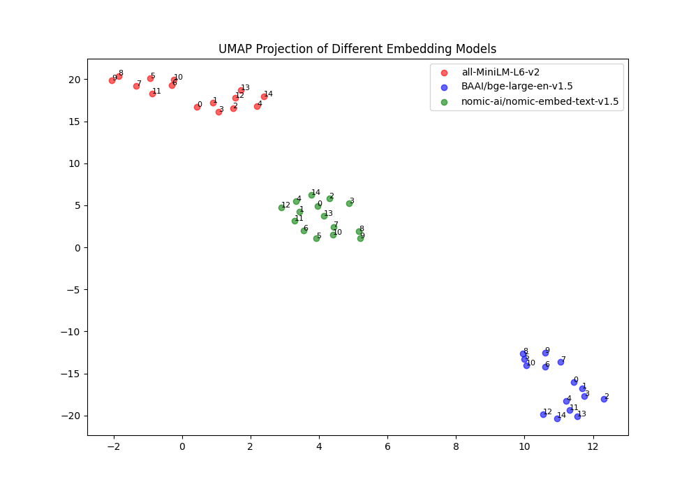

# Embedding Model Comparison

| Model | Dim | Latency (ms/doc) | Device |
|---|---|---|---|
| all-MiniLM-L6-v2 | 384 | 34.82 | CPU |
| BAAI/bge-large-en-v1.5 | 1024 | 643.19 | CPU |
| nomic-ai/nomic-embed-text-v1.5 | 768 | 391.87 | CPU |

